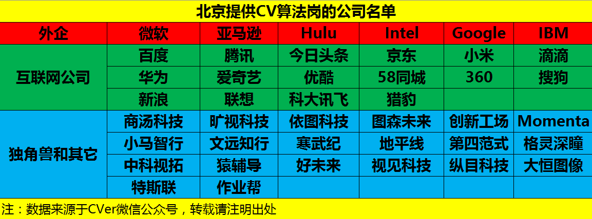
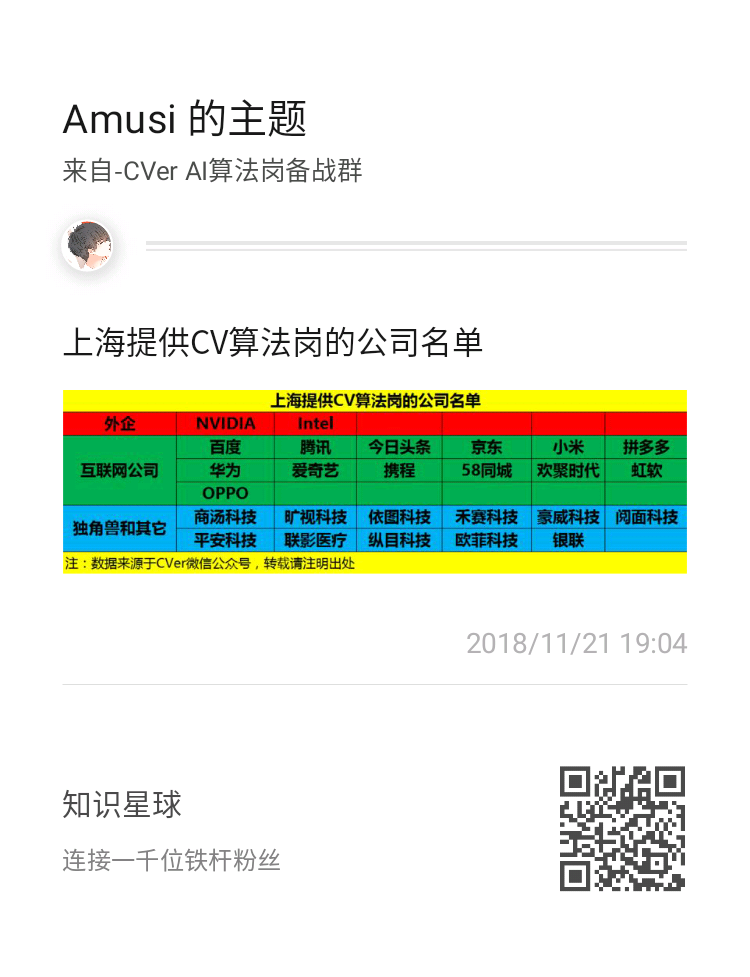
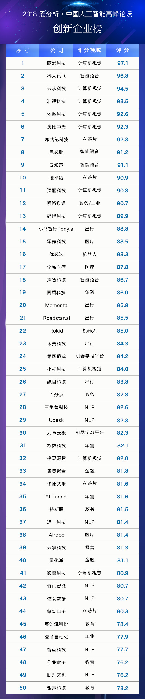

# AI-Job-Notes
AI算法岗求职攻略：涵盖校招时间表、准备攻略、刷题指南、内推、AI公司清单和答疑等资料

AI算法岗方向：深度学习、机器学习、计算机视觉、图像处理和SLAM等

# 目录

<!-- MarkdownTOC depth=4 -->

- [1 校招时间表](#Scheduled)
- [2 准备攻略](#Strategy)
- [3 刷题指南](#Coding)
- [4 内推](#Recommend)
- [5 简历模板](#Resume)
- [6 AI类公司清单](#Company)
- [7 2019届AI算法岗薪资情况](#Salary)
- [8 答疑](#Q&A)

## 1 校招时间表

以今年(2019)为例，默认为2020届学生（2019届学生称为上届）

| 时间           | 任务                                |
| -------------- | ----------------------------------- |
| 2019年3月~6月  | 找暑期实习/上届春招                 |
| 2019年6月~8月  | 秋招内推批（神仙打架）              |
| 2019年9月~11月 | 秋招正式批（神仙继续打架+菜鸡互啄） |

### 1.1 暑期实习

2019年3月~6月：暑期实习。

其实实习是任何时候都可以找的，但那不是公司规模化招聘，而是部分部门直聘，较为零散。针对实习生，很多公司，特别是大公司（如BAT等大厂），都会组织专项的暑期实习生招聘活动。暑期实习具有很大的意义，最直接的就是转正。从6月底左右实习入职，一般8月底会有实习答辩，转正后就可以结束秋招战斗了。但秋招一般会投递很多公司，所以即使在实习，也要多投。暑期实习另一个好处是增加可贵的实习经验，简历会好看很多。

### 1.2 秋招内推批

2019年6月~8月：秋招内推（神仙打架）。

据我了解上届打响秋招第一枪的是大疆(DJI)科技。6月底就已经结束简历投递了，然后BAT等大厂都是7月份开始。这时候呢，大部分都是内推/提前批，而不是正式批。大家一定要珍惜这个时间点，虽然我调侃着说神仙打架，但还是要注意这时候性价比特别高。一方面是Money普遍高，最重要的是人还不是那么多，很多人没有这方面意识，想着正式批大干一场。所以秋招内推比较难，但性价比最高了，很多大佬都是这个时间点拿到的。后面我再说说如何内推。

### 1.3 秋招正式批

2019年9月~11月：秋招正式（神仙继续打架+菜鸡互啄）。这个时间会让人很慌，有句话叫做金九银十。也就是9月份的Offer比10月份的Offer更可贵，这话其实很有道理，所以大家可以脑补到7、8月份的Offer是什么level了。这时候也很考验大家的心态，比如9月份或10月份了，还没有Offer，再看看身边人。我这里建议1.2节中秋招内推一定要把握住，如果9月份还没有收到，心态千万别崩，继续投继续干。其实大部分人都是9月、10月才陆续收到Offer的，所以你多投继续努力，收获肯定更多。而且提取批挂了，还有正式批可以再继续。

## 2 准备攻略

准备攻略，我没有具体的方案，因为这就好像是学习计划一样，每个人都要自己的习惯，我的你并不一定适用。所以我就用一个精简的公司来介绍。
公式：刷题+背题+项目+实习(可选)+竞赛(可选)+顶会/顶刊(可选)

## 3 刷题指南

刷题的目的是为了学习数据结构和算法，锻炼编程能力和熟悉刷题技巧

### 3.1 刷题编程语言

- C/C++
- Python
- JAVA（不推荐）

### 3.2 书籍推荐

| 书籍                                                         | 豆瓣评分 | 推荐指数 |
| ------------------------------------------------------------ | -------- | -------- |
| [《剑指Offer》](https://book.douban.com/subject/25910559/)   | 9.1      | ☆☆☆☆☆    |
| [《数据结构(C++语言版)》](https://book.douban.com/subject/25859528/) | 9.4      | ☆☆☆☆     |
| [《算法图解》](https://book.douban.com/subject/26979890/)    | 8.4      | ☆☆☆☆     |
| [《大话数据结构》](https://book.douban.com/subject/6424904/) | 7.9      | ☆☆☆      |
| [《算法》(第四版)](https://book.douban.com/subject/19952400/) | 9.4      | ☆☆☆      |

注：其实还有很多方向没有涉及，如linux、数据库，但暂时先推荐这些，后面再补充

### 3.3 在线刷题网站

- [LeetCode(英文)](https://leetcode.com/)
- [LeetCode(中文)](https://leetcode-cn.com/)
- [牛客网](https://www.nowcoder.com/)

### 3.4 刷题方法

推荐按类别来刷题，如数组类、链表类

### 3.5 刷题时间

现在起~2019-10-15

### 3.6 刷题重要性

正常校招流程都要进行在线笔试，面试中也可能会手撕代码，所以刷题十分影响面试结果。

## 4 内推

国内公司人工智能方向岗位的内推机会，含机器学习、深度学习、计算机视觉和自然语言处理等方向。

[AI-Job-Recommend](https://github.com/amusi/AI-Job-Recommend) 主要以全职、实习和校招为主，并且全都是内推方式！

- [实习内推](https://github.com/amusi/AI-Job-Recommend/blob/master/%E5%AE%9E%E4%B9%A0/README.md)：已含腾讯、京东和商汤等公司

- [全职内推](https://github.com/amusi/AI-Job-Recommend/blob/master/%E5%85%A8%E8%81%8C/README.md)：已含腾讯等公司

注：2019年6月开始，[AI-Job-Recommend](https://github.com/amusi/AI-Job-Recommend) 会推出大量校招内推资源，欢迎star/fork/watching。

### 4.1 内推的重要性

内推，真的太重要了。其实现在找实习也一样，内推的重要性就提醒出来了，比如我这边的资源就可以内推到BAT、商汤、旷视等公司，一般常规操作是网上投递简历，而快速直接的就是将简历送到leader/主管那里。而且内推是建立在一种互信的基础上(虽然不大)，该走的流程还是要走，但无形中增大了面试通过概率。你要知道，很多人的简历在官网或者其他第三方招聘网站上就直接卡死了。

### 4.2 如何内推？

内推的方式很多，比如：

1. 强关联：直接找已经毕业的师兄师姐或朋友内推（缺点是身边朋友去的企业有限，很多人是第一批从事算法岗的，可能都没有师兄师姐搞这个）
2. 常规操作：上牛客网论坛看企业人员发内推帖子、关注一些招聘公众号（这里我就不推荐，因为很多公众号都很有套路，内推一个企业，还要转发文章到其它群里，然后截图给他们，可是对于大多数人，为了内推，只能这么干）
3. Amusi 内推。这里感觉像似打广告一样，但确实是一个方式，因为我手里资源挺多的，很多公司的人都认识，可以直接内推。感兴趣的可以关注一下这个求职群[「2019AI算法岗求职群」](https://t.zsxq.com/VFUZR3n) 或者 [AI-Job-Recommend](https://github.com/amusi/AI-Job-Recommend)

## 5 简历模板

提供了三份简历模板，详见：[AI 算法岗简历模板](https://github.com/amusi/AI-Job-Resume)

## 6 AI类公司清单（特别是CV岗）

我之前整理了提供CV岗的公司清单（以北京、上海为主）。当然了，CV岗就是AI方向的分支，所以大致可以认为这些企业都是有AI岗的（深度学习和机器学习等岗位）。
下面我列几个名单，仅供参考（自己在整理一份更全的，但因为时间关系，这里无法给出）

**北京提供CV算法岗的公司名单**

**上海提供CV算法岗的公司名单**

**2018 爱分析—中国人工智能创新企业榜**

## 7 2019届AI算法岗薪资情况

今年是19年，所以这里以2020届为例。我是18年找的工作，但应该是2019届的，再次强调一下时间不要搞混了，所以我这里说说2019届AI算法岗的薪资情况。

我只以**硕士及一线左右城市**为例（北上广深、南京、杭州等），因为像武汉、成都，你即使找的AI算法岗，但城市不一样，薪资还是多少有区别，明显不能只看Money，不考虑城市大环境。

- **白菜价：25w~30w**

- **SP：30w~40w**

- **SSP：40w+**

说年薪有点笼统，我再说细一点，大家也可以提取熟悉一下。

一般企业薪资构成是：

- 年薪 = 月薪*12 + 年终奖

年终奖一般是2~5个月的薪资，大概是3个月

所以，年薪=月薪*15

如果你月薪2w，那么年薪就是30w=2*15（白菜的Top，SP的Down）

如果你月薪2.7w，那么年薪就是40.5w=2.7*15（SP的Top，SSP的Down）

这里po一张很全很全的高薪图，来自OfferShow

注：跟hr谈薪资的时候，如果她/他问你：你的希望薪资是多少？！这时候你一定要往高了要，至少比你想要的高30%。听我的，没有错，不然...

## 8 答疑

**7.1 没有论文没有项目但对基本模型和数学掌握不错的同学，还要找算法岗么？还是直接找开发岗算了？**

答：不要慌，问题不大。基础模型和数学不错，那么我觉得你面试方面应该就稳了，因为面试很容易让你写个反向传播呀，甚至还有解方程。大多数同学都没有拿得出手的论文（我只说顶会/顶刊），所以你需要在项目上花花工夫。

我不知道你是研究的什么方向，比如CV，那你可以去github上搜搜目标检测方面的论文源码呀。比如Faster R-CNN、YOLO、SSD都撸一遍，这找工作就会稳很多。扩展性的，你再补补最近的顶级论文，这样显得自己多么学术，面试官也会很喜欢的。

只有找算法岗，还是开发岗。说实话，这是主观问题。你想干什么，你更喜欢哪个岗位，其实自己判断就好。

**7.2 视觉算法岗位竞争越来越大，AI算法岗究竟关注什么呢？ 对于普通的CV学习者来说，是否去学点其他的结合算法知识会更吃香？ 但是这个其他的点是否可以推荐推荐~**

答：我感觉今年NLP竞争也会很大，去年相比较CV来说，NLP竞争情况还是好一点点。当然了，搞CV的太多了，没办法，市场需求来说，也是这样。AI算法岗关注就是算法/模型，你研究啥方向，啥方向的公司就能招你，你也可以投。比如百度不仅有搜索，还有近两年很火热的自动驾驶部门。搞CV，也要coding啊，因为大家找到大多是AI算法工程师，不是AI算法研究员。我觉得，你把自己的研究方向吃透了，就好很多，然后编程方面，C/C++和Python这两个要多学习多掌握。

**7.3 能否对广告推荐类的算法岗位做一些介绍？这些岗位对于项目/比赛经历一般有哪些要求？如果能提供一些面试资料，就太谢谢了！**

答：很抱歉，广告推荐类，我不太熟悉。我有同学搞这个的，回头我找他来解答一下。项目经历的话，我看同学都是去实习，攒攒经验，特别是广告推荐类，我感觉一般导师这样的项目也比较少吧。比赛的话，多关注看看Kaggle和天池等竞赛。

**7.4 前辈好，请问如果目标是cv岗的话，机器学习算法需要掌握到什么程度呢？**

答：CV岗的话，我更愿意你多精通深度学习方面的知识，特别是CNN。因为目前CV领域，CNN还是最强网络。再具体说明一定就是VGG、ResNet、DenseNet、SENet等网络，还有Faster R-CNN、DeepLab等具体方向的网络模型。当然，GAN和RNN也要了解一下，特别是GAN，这几年都一直很火爆。

**7.5 请问，开发经验还不错但是没有ai实战项目，没参加过竞赛，学校前5 985的硕士，找ai岗有戏吗？**

答：前面的问题跟这个问题很相似，而且第二章准备攻略里面说了一点：刷题+背题+项目+实习(可选)+竞赛(可选)+顶会/顶刊(可选)。所以我建议你去找个实习练练手，或者网上找找算法源码撸撸，包装成自己的性命，能够自圆其说就行。另外你的学历是加分项，但跟实习/项目经历比起来，就不是特别加分了。

**7.6 请问面试前需要对《统计学习方法》这本书熟练到什么程度？**

答：如果是CV岗，那么这是个可选项。与其看《统计学习方法》，不如把《深度学习》(花书)或者其他深度学习的理论搞清楚。如果是机器学习岗，那么就要和西瓜书一样，熟记于胸中。《统计学习方法》大多就是机器学习理论，如果你平时用到里面的知识，那么建议学习一下。

**7.7 请问以自学为主，没有项目经验的话能够想要找深度学习实习的话，要如何准备？ 目前的研究方向是基于rgbd的三维重建，如果秋招找视觉算法岗的话还需要做哪些准备呢？ 想进算法岗，但是目前没有竞赛经历。现在参加竞赛，如果进不了Top榜，这个竞赛经历还有意义吗？**

答：这三个问题，我做一块回答了。
没有项目经验，参考7.5问的回答。做哪些准备，第二章的准备攻略中，我已经给了大致方向。一般竞赛需要TOP5%或者前10，这样写到简历里才好看，不然一点加分效果也没有。

**7.8 请问，怎样能获得更多的内推机会，有哪些途径？**

答：时间已经到了，这是今天最后一个问题的回答。后面我会不定期再来回帖，大家可以继续提问。如果想及时的话，可以到我的[知识星球](https://t.zsxq.com/VFUZR3n)里学习并提问。

内推的大致方法，我已经在第四章里面介绍了。你如果说更多的内推机会，那么师兄师姐这个方式就不算了。一般就是上牛客网，或者关注校招相关的公众号，那上面都会经常更新内推方式的。这种方式，唯一缺点就是，你不知道内推上了没有，然后还有转发转发再转发。

所以同时，我也建议需要内推的小伙伴，可以加入我的[2019AI算法岗求职群](https://t.zsxq.com/VFUZR3n)（PS：有同学私信我，为什么打不开，我建议用微信端打开）。可内推的公司有：阿里达摩院，头条，腾讯，京东，华为，Intel，虹软，大华，VIVO，OPPO，科大讯飞，商汤，创新工厂，思必驰，瓜子二手车等公司。

**再强调一点，实习真的真的很重要！内推真的真的很重要！**

注：如果你看到这篇文章，且有一些疑问或者想提供一些资源，欢迎提交issues！

