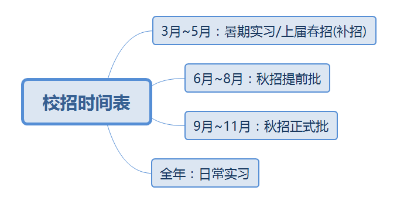
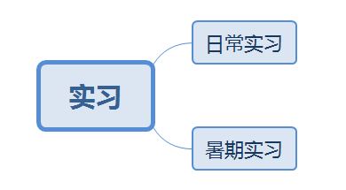
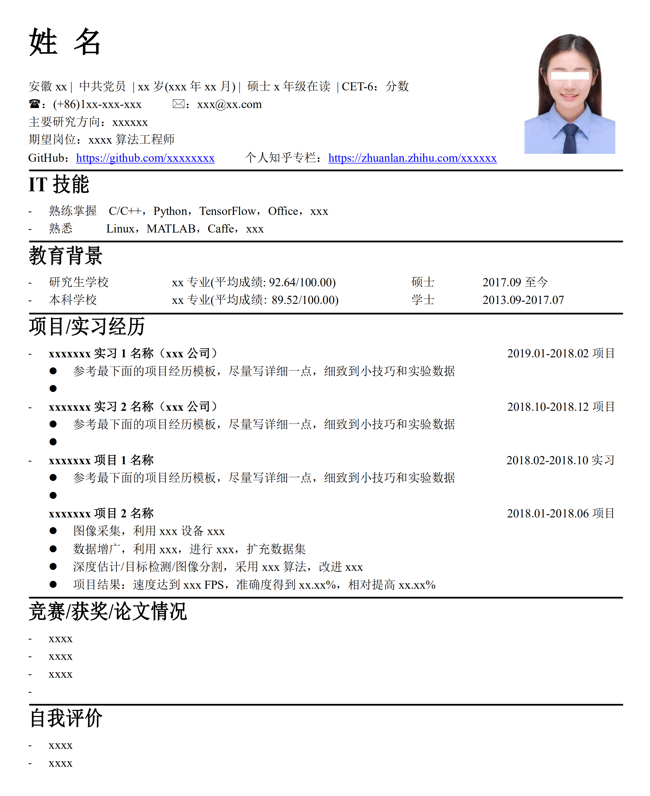
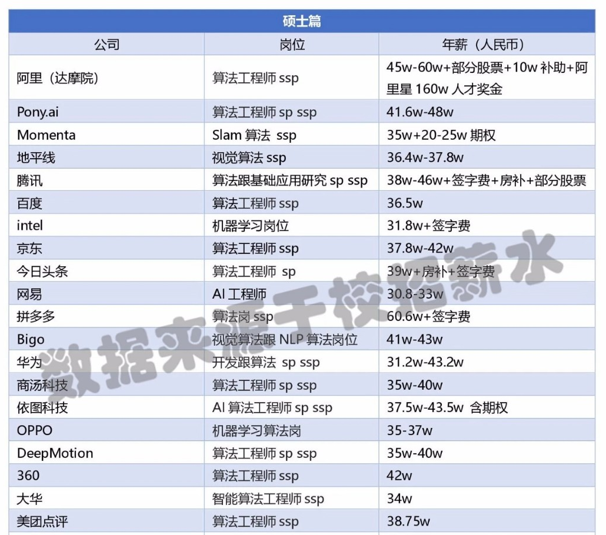
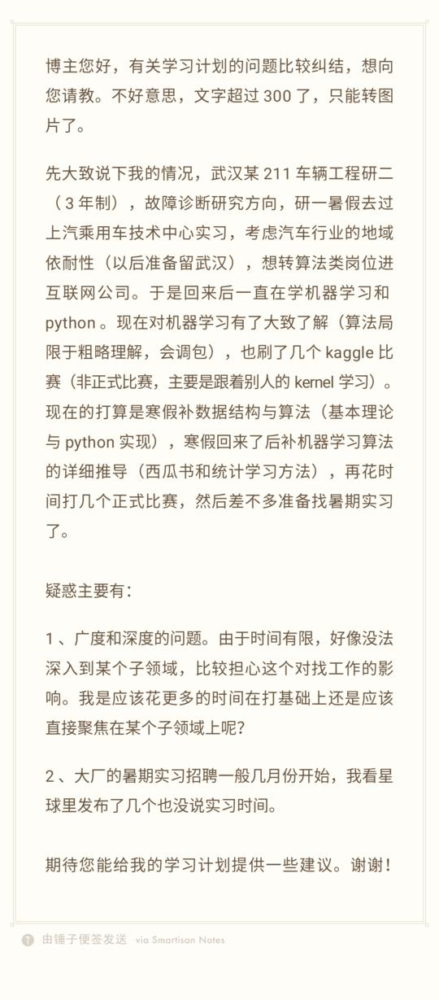
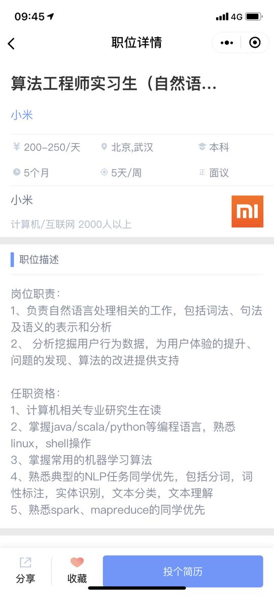
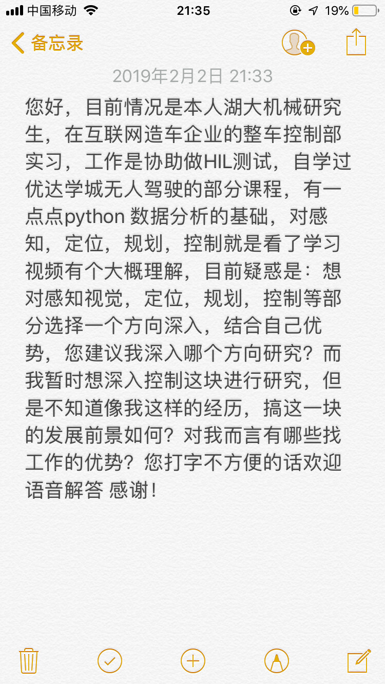
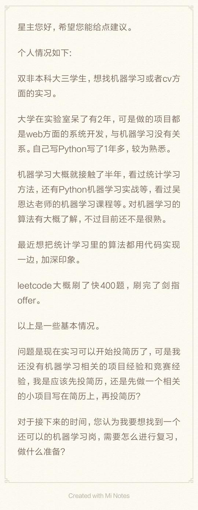
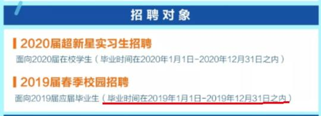

# AI-Job-Notes
AI算法岗求职攻略：涵盖校招时间表、准备攻略、刷题指南、内推、AI公司清单和答疑等资料

AI算法岗方向：深度学习、机器学习、计算机视觉、图像处理和SLAM等

>  注：如果你看到这篇文章，且有一些疑问或者想提供一些资源，欢迎提交issues！

# 目录

<!-- MarkdownTOC depth=4 -->

- [1 校招时间表](#Scheduled)
- [2 准备攻略](#Strategy)
- [3 刷题指南](#Coding)
- [4 内推](#Recommend)
- [5 简历模板](#Resume)
- [6 AI类公司清单（以CV岗为主）](#Company)
- [7 2019届AI算法岗薪资情况](#Salary)
- [8 答疑（含130个问答）](#Q&A)

## 1 校招时间表

以今年(2019)为例，默认为2020届学生（2019届学生称为上届）

| 时间           | 任务                                |
| -------------- | ----------------------------------- |
| 2019年3月~6月  | 找暑期实习/上届春招（补招）         |
| 2019年6月~8月  | 秋招提前批（神仙打架）              |
| 2019年9月~11月 | 秋招正式批（神仙继续打架+菜鸡互啄） |

### 1.1 暑期实习

2019年3月~6月：暑期实习。

实习一般分成两种：

- 日常实习
- 暑期实习

**日常实习**：日常实习是任何时候都可以找的，通常是根据具体部门的需求，由公司HR、部门主管或者部门员工发布招聘消息，相对较为零散也比较灵活。

**暑期实习**：很多公司，特别是大公司（如BAT等大厂），都会组织专项的**暑期实习生**招聘活动。一方面是针对在校学生的情况（很多学生只有暑期才有假期，或者导师暑假才放人），另一方面就是为了秋季校招（大规模招聘）吸引人才。暑期实习具有很大的意义，对学生来说，最直接的好处就是转正机会。暑期实习，一般6月底左右实习入职（也可以根据自己的时间，提前入职），一般8月底或9月份会有专项暑期实习答辩，根据综合表现，答辩通过后就可以基本结束秋招了。

注：这里建议在进入公司参加暑期实习的期间，也要参加秋招提前批和秋招正式批，并多投递一些公司，即使在实习，所谓的很忙，没时间准备秋招了，那也要多投。暑期实习的另一个好处是增加可贵的实习经验，简历会好看很多。

### 1.2 秋招提前批

**2019年6月~8月：秋招提前批（神仙打架）**

据我了解上届打响秋招第一枪的是大疆(DJI)科技，其在6月底就已经结束简历投递了，然后BAT等大厂都是7月份开始。这时候的校招，绝大部分都是内推/提前批，而不是正式批，大家一定要珍惜这个时间点：6月~8月。虽然我调侃着说神仙打架，但还是要注意这时候性价比特别高。一方面是薪资普遍高，通常一些SP/SSP Offer都是这个节点发出来的，另一方面是投递的人数还不是很多，因为有些人没有意识到这个提前批的重要性，老想着多准备一点，到秋招正式批再大干一场。

需要注意的是：参与秋招提前批的大佬特别多，同时岗位hc并不多（因为企业要考虑正式批的情况，会控制招聘人数），所以我把秋招提前批比作：神仙打架。另外，秋招提前批大多以内推为主，后面章节中我会说到如何获取招聘信息以及如何内推。

注：提取批挂了，正式批可以再继续投（具体看不同公司的招聘介绍）。

### 1.3 秋招正式批

**2019年9月~11月：秋招正式（神仙继续打架+菜鸡互啄）**

有句话叫做金九银十，也就是9月份的 Offer 比10月份的 Offer 更可贵，这话其实很有道理，所以大家可以脑补到7、8月份的 Offer 属于什么 level 了。这时候也很考验大家的心态，比如9月份或10月份了，如果你手里还没有Offer，再看看身边已经拿到Offer的同学，一定变成柠檬精。

所以 Amusi 这里强烈建议一定要把握住 1.2节中的**秋招提前批 **。当然了，如果9月份手里还没有Offer，心态千万别崩，继续投继续干，记住一句话：多投准没错！其实大部分同学都是9月、10月才陆续收到Offer的，所以你多投继续努力，收获肯定会有的。

## 2 准备攻略

准备攻略，我没有具体的方案，因为这就好像是学习计划一样，每个人都要自己的习惯，我的你并不一定适用。所以我就用一个精简的公司来介绍。
公式：刷题+背题+项目+实习(可选)+竞赛(可选)+顶会/顶刊(可选)

## 3 刷题指南

刷题的目的是为了学习数据结构和算法，锻炼编程能力和熟悉刷题技巧

刷题建议：先刷[《剑指Offer》](https://www.nowcoder.com/ta/coding-interviews)（66题），再刷 [LeetCode](https://leetcode.com/)（目前LeetCode已经有900+题，可以根据类别来刷，但强烈建议先刷完 [LeetCode 面试高频题](https://leetcode.com/problemset/top-interview-questions/)）

### 3.1 刷题编程语言

- C/C++
- Python
- JAVA（不推荐）

> 注：如果时间充裕，而且有C++基础，那么强烈建议使用 C++和 Python 同时刷题

### 3.2 书籍推荐

| 书籍                                                         | 豆瓣评分 | 推荐指数 |
| ------------------------------------------------------------ | -------- | -------- |
| [《剑指Offer》](https://book.douban.com/subject/25910559/)   | 9.1      | ☆☆☆☆☆    |
| [《数据结构(C++语言版)》](https://book.douban.com/subject/25859528/) | 9.4      | ☆☆☆☆     |
| [《算法图解》](https://book.douban.com/subject/26979890/)    | 8.4      | ☆☆☆☆     |
| [《大话数据结构》](https://book.douban.com/subject/6424904/) | 7.9      | ☆☆☆      |
| [《算法》(第四版)](https://book.douban.com/subject/19952400/) | 9.4      | ☆☆☆      |

>  注：其实还有很多方向没有涉及，如linux、数据库，但暂时先推荐这些，后面再补充

### 3.3 在线刷题网站

- [LeetCode(英文)](https://leetcode.com/)
- [LeetCode(中文)](https://leetcode-cn.com/)
- [牛客网](https://www.nowcoder.com/)：推荐剑指Offer和各大公司往年题库，牛客网的优势在于很多公司都会使用其作为在线刷题平台，所以在这上面刷题，有利于懂得输入输出等"套路"

### 3.4 刷题方法

- 《剑指Offer》全刷完
- LeetCode选择性刷：可以类别来刷题，如数组类、链表类，或者面试高频类

### 3.5 刷题时间

现在起~2019-10-15

### 3.6 刷题重要性

正常校招流程都要进行在线笔试，面试中也可能会手撕代码，所以刷题十分影响面试结果。

## 4 内推

国内公司人工智能方向岗位的内推机会，含机器学习、深度学习、计算机视觉和自然语言处理等方向。

[AI-Job-Recommend](https://github.com/amusi/AI-Job-Recommend) 主要以全职、实习和校招为主，并且全都是内推方式！

- [实习内推](https://github.com/amusi/AI-Job-Recommend/blob/master/%E5%AE%9E%E4%B9%A0/README.md)：已含腾讯、京东和商汤等公司

- [全职内推](https://github.com/amusi/AI-Job-Recommend/blob/master/%E5%85%A8%E8%81%8C/README.md)：已含腾讯等公司

注：2019年6月开始，[AI-Job-Recommend](https://github.com/amusi/AI-Job-Recommend) 会推出大量校招内推资源，欢迎star/fork/watching。

### 4.1 内推的重要性

内推，真的太重要了。其实现在找实习也一样，内推的重要性就提醒出来了，比如我这边的资源就可以内推到BAT、商汤、旷视等公司，一般常规操作是网上投递简历，而快速直接的就是将简历送到leader/主管那里。而且内推是建立在一种互信的基础上(虽然不大)，该走的流程还是要走，但无形中增大了面试通过概率。你要知道，很多人的简历在官网或者其他第三方招聘网站上就直接卡死了。

### 4.2 如何内推？

内推的方式很多，比如：

1. 强关联：直接找已经毕业的师兄师姐或朋友内推（缺点是身边朋友去的企业有限，很多人是第一批从事算法岗的，可能都没有师兄师姐搞这个）
2. 常规操作：上牛客网论坛看企业人员发内推帖子、关注一些招聘公众号（这里我就不推荐，因为很多公众号都很有套路，内推一个企业，还要转发文章到其它群里，然后截图给他们，可是对于大多数人，为了内推，只能这么干）
3. Amusi 内推。这里感觉像似打广告一样，但确实是一个方式，因为我手里资源挺多的，很多公司的人都认识，可以直接内推。感兴趣的可以关注一下这个求职群[「2019AI算法岗求职群」](https://t.zsxq.com/VFUZR3n) 或者 [AI-Job-Recommend](https://github.com/amusi/AI-Job-Recommend)

## 5 简历模板

提供了三份简历模板，详见：[AI 算法岗简历模板](https://github.com/amusi/AI-Job-Resume)

## 6 AI类公司清单（以CV岗为主）

首先 AI > CV，所以提供CV岗的公司肯定就提供 AI岗。但至于这些公司是否还有 NLP、机器学习、语音识别、推荐算法和 SLAM等岗位，这个需要大家自行去官网进行了解。

荐读：[国内提供计算机视觉(CV)算法岗位的公司名单(含外企和国内公司)](https://github.com/amusi/CV-Jobs)

**北京提供CV算法岗的公司名单**

更多城市信息（上海/深圳杭州等）详见：https://github.com/amusi/CV-Jobs

## 7 2019届AI算法岗薪资情况

今年是19年，所以这里以2020届为例。我是18年找的工作，但应该是2019届的，再次强调一下时间不要搞混了，所以我这里说说2019届AI算法岗的薪资情况。

我只以**硕士及一线左右城市**为例（北上广深、南京、杭州等），因为像武汉、成都，你即使找的AI算法岗，但城市不一样，薪资还是多少有区别，明显不能只看Money，不考虑城市大环境。

- **白菜价：25w~30w**

- **SP：30w~40w**

- **SSP：40w+**

说年薪有点笼统，我再说细一点，大家也可以提取熟悉一下。

一般企业薪资构成是：

- 年薪 = 月薪*12 + 年终奖

年终奖一般是2~5个月的薪资，大概是3个月

所以，年薪=月薪*15

如果你月薪2w，那么年薪就是30w=2*15（白菜的Top，SP的Down）

如果你月薪2.7w，那么年薪就是40.5w=2.7*15（SP的Top，SSP的Down）

这里po一张很全很全的高薪图，来自OfferShow

注：跟hr谈薪资的时候，如果她/他问你：你的希望薪资是多少？！这时候你一定要往高了要，至少比你想要的高30%。听我的，没有错，不然...

## 8 答疑

**8.1 没有论文没有项目但对基本模型和数学掌握不错的同学，还要找算法岗么？还是直接找开发岗算了？**

答：不要慌，问题不大。基础模型和数学不错，那么我觉得你面试方面应该就稳了，因为面试很容易让你写个反向传播呀，甚至还有解方程。大多数同学都没有拿得出手的论文（我只说顶会/顶刊），所以你需要在项目上花花工夫。

我不知道你是研究的什么方向，比如CV，那你可以去github上搜搜目标检测方面的论文源码呀。比如Faster R-CNN、YOLO、SSD都撸一遍，这找工作就会稳很多。扩展性的，你再补补最近的顶级论文，这样显得自己多么学术，面试官也会很喜欢的。

只有找算法岗，还是开发岗。说实话，这是主观问题。你想干什么，你更喜欢哪个岗位，其实自己判断就好。

**8.2 视觉算法岗位竞争越来越大，AI算法岗究竟关注什么呢？ 对于普通的CV学习者来说，是否去学点其他的结合算法知识会更吃香？ 但是这个其他的点是否可以推荐推荐~**

答：我感觉今年NLP竞争也会很大，去年相比较CV来说，NLP竞争情况还是好一点点。当然了，搞CV的太多了，没办法，市场需求来说，也是这样。AI算法岗关注就是算法/模型，你研究啥方向，啥方向的公司就能招你，你也可以投。比如百度不仅有搜索，还有近两年很火热的自动驾驶部门。搞CV，也要coding啊，因为大家找到大多是AI算法工程师，不是AI算法研究员。我觉得，你把自己的研究方向吃透了，就好很多，然后编程方面，C/C++和Python这两个要多学习多掌握。

**8.3 能否对广告推荐类的算法岗位做一些介绍？这些岗位对于项目/比赛经历一般有哪些要求？如果能提供一些面试资料，就太谢谢了！**

答：很抱歉，广告推荐类，我不太熟悉。我有同学搞这个的，回头我找他来解答一下。项目经历的话，我看同学都是去实习，攒攒经验，特别是广告推荐类，我感觉一般导师这样的项目也比较少吧。比赛的话，多关注看看Kaggle和天池等竞赛。

**8.4 前辈好，请问如果目标是cv岗的话，机器学习算法需要掌握到什么程度呢？**

答：CV岗的话，我更愿意你多精通深度学习方面的知识，特别是CNN。因为目前CV领域，CNN还是最强网络。再具体说明一定就是VGG、ResNet、DenseNet、SENet等网络，还有Faster R-CNN、DeepLab等具体方向的网络模型。当然，GAN和RNN也要了解一下，特别是GAN，这几年都一直很火爆。

**8.5 请问，开发经验还不错但是没有ai实战项目，没参加过竞赛，学校前5 985的硕士，找ai岗有戏吗？**

答：前面的问题跟这个问题很相似，而且第二章准备攻略里面说了一点：刷题+背题+项目+实习(可选)+竞赛(可选)+顶会/顶刊(可选)。所以我建议你去找个实习练练手，或者网上找找算法源码撸撸，包装成自己的性命，能够自圆其说就行。另外你的学历是加分项，但跟实习/项目经历比起来，就不是特别加分了。

**8.6 请问面试前需要对《统计学习方法》这本书熟练到什么程度？**

答：如果是CV岗，那么这是个可选项。与其看《统计学习方法》，不如把《深度学习》(花书)或者其他深度学习的理论搞清楚。如果是机器学习岗，那么就要和西瓜书一样，熟记于胸中。《统计学习方法》大多就是机器学习理论，如果你平时用到里面的知识，那么建议学习一下。

**8.7 请问以自学为主，没有项目经验的话能够想要找深度学习实习的话，要如何准备？ 目前的研究方向是基于rgbd的三维重建，如果秋招找视觉算法岗的话还需要做哪些准备呢？ 想进算法岗，但是目前没有竞赛经历。现在参加竞赛，如果进不了Top榜，这个竞赛经历还有意义吗？**

答：这三个问题，我做一块回答了。
没有项目经验，参考7.5问的回答。做哪些准备，第二章的准备攻略中，我已经给了大致方向。一般竞赛需要TOP5%或者前10，这样写到简历里才好看，不然一点加分效果也没有。

**8.8 请问，怎样能获得更多的内推机会，有哪些途径？**

答：时间已经到了，这是今天最后一个问题的回答。后面我会不定期再来回帖，大家可以继续提问。如果想及时的话，可以到我的[知识星球](https://t.zsxq.com/VFUZR3n)里学习并提问。

内推的大致方法，我已经在第四章里面介绍了。你如果说更多的内推机会，那么师兄师姐这个方式就不算了。一般就是上牛客网，或者关注校招相关的公众号，那上面都会经常更新内推方式的。这种方式，唯一缺点就是，你不知道内推上了没有，然后还有转发转发再转发。

所以同时，我也建议需要内推的小伙伴，可以加入我的[2019AI算法岗求职群](https://t.zsxq.com/VFUZR3n)（PS：有同学私信我，为什么打不开，我建议用微信端打开）。可内推的公司有：阿里达摩院，头条，腾讯，京东，华为，Intel，虹软，大华，VIVO，OPPO，科大讯飞，商汤，创新工厂，思必驰，瓜子二手车等公司。

**再强调一点，实习真的真的很重要！内推真的真的很重要！**

**8.9 现在cv岗都有哪些普遍要求啊？或者说有哪些是应聘这些岗位必需的技能，对c++和python哪个比较看重啊？如果实验室没有项目的话，您有一些推荐的入手项目或是比赛吗？还有就是本人研二，想在明年6月左右找个cv的实习，希望您能给我一些建议，感恩！**

答：

1.CV岗有哪些要求？

答：这个我会后面整理一下，做一下总结。大家可以持续关注我在星球里陆续po出的每家公司算法岗的要求。自己先做总结，然后我会给我的总结。

2.对C++和Python哪个比较看重？

答：Python无门槛，C++难度系数高。Python入门很快，基础的知识及相关的库 如numpy，panda和matplotlib掌握就行。Python进阶不是特别难，你看一下《流畅的Python》书籍和一些tricks就行。至于C++，这玩意没个好几年沉淀，千万别说自己掌握或者精通。C++也是体现写代码有多刚的方面，CUDA加速等。

3.如果实验室没有项目，有哪些推荐的入手项目或比赛？

答：自己搞事情的话，CV领域，选一个方向，上Google Scholar或arXiv搜一下最新的review/survey，然后github搜一下该领域awesome/sota系列。然后从经典的算法到最新代表性的算法，论文+代码+实验。比赛方面，去kaggle上关注一下就行，看有没有中意的项目，然后打比赛，目前国内面向高校的TOP AI创新大赛也在举办中，可以参与实战一下。

4.实习。

答：实习越早越好，厂子越大越好，能学习到知识最好，不行赶紧换另一家，当然建议找到合适的后，实习三个月以上，因为跟进一个项目，这个时间才刚刚好。怎么找实习呢，内推啊！可以单独私我，我会尽力帮你内推。我也会不定期在星球里分享实习/校招信息，你关注这个也OK。自己搜集信息的话，建议牛客+实习僧。
加油～越早准备，大厂Offer就越稳

**8.10 请问一下我们这一行，六级没过对找工作影响大吗？会作为一个应聘前提直接卡人吗？哪些公司对六级有明确要求或者比较看重？**

答：我校招投递了也有50+公司，面了超20+吧，感觉只有一个公司看这个六级和学历，它就是银联。不能说这么绝对，其实是银联报名的人太多了，不得不卡，再加上本身“国企”那种属性。单论互联网公司，包括华为中兴等公司，六级这个东西，不那么重要。因为跟你学历，能力，经验相比，这六级一点都不重要。放心，六级没过，不用慌。今天不是刚考了么，祝你开奖哈！

**8.11 学长你好，想请问一下，如果目标是大厂的cv算法岗的话，c++需要掌握到什么程度呢？**

答：嗯，建议任何人校招的目标都应该是大厂或者独角兽。C++掌握到什么程度，我想从“应付”校招角度来说。1.对与笔试和面试，刷题是最好的方式。可以锻炼你动手能力，思维能力和调用常见api能力。2.对于面试，背题是最便捷的方式。因为面试者会问你很多基础知识点，如虚函数/虚函数表、四种强制类型转换区别等。其实很多你都没有用过，也不可能一一实践理解，所以背题也ok的。3.如果有C++项目，那是最好，可以吹一波这个。如果没有，那也没关系，因为1和2搞定就行了。

**8.12 想请问下没有能看的比赛经历怎么办？感觉没有排名靠前的比赛竞争力下降好多。数据竞赛和图像竞赛方向，个人两个方向都比较喜欢。**

答：大多数同学都没有能看的比赛经历，甚至连比赛经历都没有。如果想拿到好名次，那就多关注最近的比赛，看看是否有合适的，重点更进。如果想弥补这一点，也可以通过实习来弥补。另外，打比赛组队也很重要，所以可以找找大神或者其他小伙伴一块。

**8.13 群主你好，请问一下大厂对于找实习一般有些什么要求呢？最近周围有师兄在发实习内推的消息，想投一投试试。想问一下：**

1. 实习需要走在线笔试再面试等流程吗

2. 重点应该准备数据结构等计算机基础还是常用机器学习深度学习算法呢？

目标是视觉岗，项目经历有一些，没有kaggle得奖经历

答：你可以说具体哪些公司哈，因为大厂蛮多的，实习生都是不同招法。比如Momenta也算独角兽了，他家的火箭计划就是需要在线做题 筛选。这里说说大部分公司，实习内推可以直接联系到项目负责人，那么直接参与面试。面试通常一下子面完吧，但也有三轮的样子。比如技术面，技术面，hr面（腾讯就是这样的）。总之，不管形式如何，coding能力一定要锻炼起来，比如刷题这种应试能力。再者就是基础知识和项目经验。基础知识最重要，比如cnn，目标检测常见算法。然后简历上，项目经历写的东西，自己一定要做到自圆其说，项目里的知识点一定要会，因为这是自己写上去的，所以一定要有把握。

**8.14  群主，你好！目前我研二计算机专硕，研究方向是目标跟踪，然后呢 导师那主要是以学术为主 催着写论文，已经有一篇论文了，但是我不想走学术，想做工程之类的。目前我觉得自己的能力太差了，努力的方向也有点迷茫。想咨询下您，这个时候该继续做下去还是 往工程那方向学。**
**还有一个问题，如果导师不同意实习的话，怎么办。我看我那些师兄师姐都在研三下学期的时候才找工作，都是很安逸轻松的工作。我不想那时候再去找工作。想去大城市闯。**

答：我觉得学术和工程没有太大区别，因为你写论文，实验部分也是需要写代码跑模型的吧。你所在的环境应该也不是纯学术的，你看看何恺明是研究员，不也是要写代码么，而且写的很好。不放实习，我的建议是你自己估计能不能偷偷溜出去实习。如果能，那就溜出去，每周三天那种，不行的话，老老实实在实验室撸代码，打比赛也很舒服呀。我不知道你是几年制的，哪年毕业。比如2020届的，今年6月份就要开始准备秋招了。

**8.15 请教楼主下，本人读研期间研究人体动作识别，发表有sci论文。毕业半年从事软件开发工作，想半年内转行回去计算机视觉类工作难度大嘛，需要做哪些准备呢？**

答：认识一个朋友，就是后面转CV算法岗了。我觉得你是有一点基础的，不管是深度学习还是CV，因为你说研究生研究的是人体动作识别，还发了SCI。所以底子有了，需要做的就是再捡起来。我那个朋友就是自己平时下了班，跑跑模型，调调参，偶尔参加参加比赛，练练手。所以你打算半年内转行，我觉得很重要的是捡起这些东西。近两年的经典和最新paper看起来，感兴趣方向的代码跑起来，朝着自己想要去的公司和岗位定下目标。还有很重要的是coding能力也有锻炼，因为你也刚毕业没多久，手撕代码能力依旧是很多大公司看重的。总结来说，跟踪最新cv论文，代码多看一些，跑跑模型调调参，最好能参加参加竞赛弥补一下项目上的缺失。然后就是leetcode刷题也要跟上。加油

**8.16 你好，想问下，实习觉得是去大公司好，还是小公司比较好？**

答：实习强推大公司，毕竟是为了最重要的校招。如果你没有顶会，没有出色的竞赛排名，没有NB的项目经验，大公司实习必须要拿下。不要指望实习能学到什么，你把这当做一个过渡和跳板就行。总之，如果有的选择，一定要去大公司。

**8.17 群主好，有个问题想咨询下，我目前研二，三年的研究生，方向是自然语言处理，然后目前在一家南京的小公司实习，已经实习了20天，但是发现实习跟我想的不大一样，我是进的自然语言处理岗位，但是目前完全没有涉及到各种太深的算法，唯一用的，就是word2vec找相似词，而是基本都是给你一个知识点让你自己去看，没有什么指导？目前还让学习elastic search ，还有flask这些感觉是web 的东西，就不是很懂，这个正常吗，一般的算法实习是做什么工作？还有我要不要重新找一家公司？还有真正找实习的时候，面试官会看重实习经历吗？**

答：你的方向是NLP，实习的是小公司，但实际上手并不是很相关，还涉及FLASK等python爬虫/web相关知识。首先，算法实习应该是强关联的，比如学习CV，就让我去搞深度学习，什么目标检测/分割，即使有部分数据清洗work也能了解数据本身，这都是强关联的。我觉得你可以自己判断一下，现在做的项目是什么业务，然后NLP用的多不多。如果自己觉得不靠谱，不能作为以后吹NB的资本（NLP强关联项目），就赶紧结束这个实习吧。南京也有不少公司，我觉得可以再找找。因为实习最关键是两个，厂子大不大，能不能学到知识（吹NB的资本）。所以需要你自己判断所在的公司，所在的岗位具体什么情况，这种现状是暂时的，还是长期的。如果是长期的，赶紧走。

**8.18 博主,你好,认识您好久了,我也在那个算法岗求职群里,最近,经常在群里看到实习的内容,但想找算法岗到底是CV还是NLP实在不知道,想跟您介绍下自己的情况,希望能给些指导性的建议,研一到研二学了python,C++,统计学习方法,花书看到了RNN截止,还有网易吴恩达的深度学习课程,但一直没有拿得出手的跟算法相关的项目比赛,下学期老师要出去访学,打算找一个实习,不知道现在定一个方向(Cv/NLP)寒假补补缺失的东西,下学期去实习来得及么?有什么建议么?**

答：我感觉你对CV和NLP都有一定了解，哈哈，我只对CV熟悉一点。我觉得以兴趣为主吧，比如CV方面，看看自己对CNN网络感觉如何，NLP方向，看看自己对LSTM、RNN等感觉如何。确定好方向很重要，因为会影响你之后的走向，最好一开始就坚定自己想要的。我觉得CV和NLP差别蛮大的，希望你自己能把握好自己想要的。没有拿到出手的比赛和项目，这不重要，因为去实习，一方面就是为了解决这个问题的。我觉得寒假是一个很好的机会，去给自己时间确定自己选择哪个方向。寒假应该会开始刷题打卡活动，希望你可以参与进来。实习的话，永远不会迟，总之越早越好。我的建议是，你现在先确定自己的方向，然后去各大厂看一下实习要求，尽量往上面靠。

**8.19 学长好，最近看到好多招实习的自己还没开始投简历有点紧张。请问一下现在投递简历是最近就面试还是会隔一段时间比如到二三月份才开始面试呢？是不是还是多准备一点再开始投简历呢？**

答：简历早点投，没啥影响。具体面试时间，应该要看公司的。我觉得可以先投，拿到Offer，年后入职很正常。开学后，找实习的肯定一大把，如果现在已经有hc，不如现在就找。越早拿下，麻烦越少，到时候还可以挑一挑。大多公司的实习要求并不是很高的，我觉得你可以先尝试投一下，况且投了之后不一定很快就给你答复的。

**8.20 学长你好，有个问题啊。听说互联网秋招的提前批6月份就开始了，可是我可能暑假才有时间实习。这不是冲突么，有点焦虑啊。**

答：很多老师暑假才放实习的，这也正常，我室友就是这样。我的建议是暑期可以实习，也可以不实习。先说说实习，一定要找个大厂，不然意义不大，因为暑假找工作就很忙了，如果还是小公司，时间成本太高。去大公司的目的，要以转正为目的，多一个Offer好办事。另外，无形给你找工作提供了便利，毕竟大厂光环。不实习也ok，安心准备找工作，暑假提前批也会很忙很忙，可能两三天一个笔试，面试，你还要复习。我建议是可以找一波，看看公司看看岗位是否契合，再做决定。

**8.21 详见图片**

答：1.广度和深度这两个其实没有舍与得。基础很重要，但写在简历中的项目不可能是网上看的课程呀，肯定是聚焦在某个任务上面，这里自然就有深度。所以一般广度我理解成基础吧，这里不是说对每个方向都如数家珍，而且该懂的应该懂。如机器学习中的SVM、Adaboost这些不存在方向性问题，都是基础。我建议是聚焦一两个项目，进行深入，好写在简历上面。而且你还有kaggle竞赛经历，也可以包装一下。
2.大厂暑期实习，一般和春招时间一样，2019年的2月底~5月。
3.打比赛挺好的，高名次的话，不比实习差，含金量更高一点。我觉得实习可以好好找找，比赛也可以继续打，因为又不是每天忙比赛。基础知识的话，机器学习/深度学习各个知识点也可以再多多复习，刷题也可以每天搞一两道。

**8.22 球主你好，我想问申请大厂实习成功率高吗？ 背景：武汉985，大四统计专业，保研到人大统计，去年7月到今年1月在北京的一家创业互联网公司实习，职位是算法工程师，主要工作就是python数据整理，特征提取，用机器学习算法建模预测，也有一些开发，工程化的经历（与大数据部门对接过），毕竟不是计算机专业，编程能力不能和科班比。 下学期想在武汉找一个深度学习nlp，cv相关的，之前的实习没有接触过深度学习，所以不清楚现在的能力投简历能面试成功吗？或者是马上过年了，我利用寒假一个月的时间学深度学习，然后开学再投简历吗？不知道大厂实习的要求！ 只能放一张图，还有一个岗位是腾讯武汉研发中心的语音算法实习生。**

答：大厂实习成功率，我觉得看具体部门具体岗位的。非重点型的，我觉得还ok，因为实习的岗位一般要求不是很高，毕竟不是正式秋招。我觉得你的学校背景很ok，专业也很硬，从保研角度来看，学习成绩也ok的，你也有一定的实习经历（机器学习方向）。从履历来看，基本大厂的门槛，即使是重点实验室，我觉得都ok的。接下来就看你的面试情况。比如你想投递CV或者NLP，我觉得还是要有一定认知，也就是基础的。因为现在快过年了，实习生即使安排上，也不能立即入职，通常是年后入职。虽然我鼓励早点投递，但涉及具体方向，比如CV、NLP，其实还是跟机器学习有点出入的，比如CNN、RNN等知识。我建议是花个寒假时间，快速入门即可。因为你是统计专业，数学应该很ok，所以只要方向性了解一下，实习Offer应该没啥问题。比如寒假看一下，吴恩大的deeplearning.ai课程（搭配《深度学习》花书），然后CV方向看一下CS231n课程，NLP方向看一下CS224n和CS224d，然后论文和LeerCode也可以刷刷。大厂的实习要求，我觉得是看学生的学习综合能力，快速上手能力。了解一下基础，能深入下去，就已经很好了。加油

**8.23 Amusi你好，我想问下，ccf c类的论文对找实习与工作有多大的帮助？**

答：应该说很大吧，如果面试官知道(因为C类还是蛮多的)，那应该很有谈资。我觉得这和项目，竞赛的效果一样，面试聊这些OK的。总之，光环是有的，面试表现ok，很稳的。加油

**8.24 师兄，你好。 说一下个人背景: 本科，电子科技大学，测控技术与仪器 硕士两年，女生为了离家近，阴差阳错保研来到了中大的数据院。本科基本上没有计算机的基础，选修过C语言。 目前，面临毕业要发论文，主要做的医学图像分类春招要找实习。感觉自己机器学习的框架没有建立起来，coding能力也很差。目前我很慌，想找机器学习方面的，简历没啥可写的，又不敢投，描述的逻辑不清，师兄能否给个建议。**

答：我建议你快速入门一下Python（半个月），然后学习一下PyTorch或者TensorFlow（这两个主要是深度学习方向，但机器学习其实也默认了要学，学习一个就行了）。课程的话，吴恩达的机器学习课程也不错，网易云课堂上都有视频，你可以去github上找找课后作业。你做的是医学图像分类，我感觉更偏向深度学习。但你既然说了机器学习，那我就先回答这方面的。如果你后面有补充深度学习/计算机视觉，我再给你补充。机器学习方面，框架已经介绍了，那我建议你再快速了解SVM、GBDT和XGBoost等基础知识（面试经常问），编程方面，我建议以Python为主，C++为辅（C++若没有时间，可以不学）。书的话，《统计学习方法》或者《机器学习》西瓜书也可以买本看，虽然理论很多，但很多问题都是对知识的提炼。另外推荐看一下这个机器学习资料：<https://t.zsxq.com/aAmmaQZ>

**8.25 您好，我是已经工作两年多的本科毕业生，目前在SAP做JavaScript，但是图像处理这一块自己一直比较喜欢，大学期间也做了很多项目，但是毕业时候因为个人原因没能进入到图像处理领域。现在自己在业余时间学习，但是有时候挺迷茫，感觉要掌握的东西太多，想问一下图像这块面试的时候需要掌握机器学习（支持向量机，决策树等），深度学习（CNN RNN等），目标检测（YOLO FasterRCNN等），线性代数的具体内容（特征值，特征向量等），这些哪些是经常问的？或者说比较重要（虽然我感觉确实都挺重要...）我自己感觉把每一项都掌握很全面有点挺难的，想问一下我该怎么规划自己的准备过程，谢谢～**

答：如果是想找CV方向的工作，我建议先学深度学习吧（机器学习太大了，比如SVM、决策树、Adaboost现在已经在CV方面不主流了）。深度学习，把吴恩达的deeplearning.ai课程看一遍（讲的比较全），然后重点放在CNN上面（近几年出名的VGG、ResNet、DenseNet、SENet都是在CNN上做文章）。目标检测其实是一个方向，我建议你搞明白自己想研究什么方向最好，如果没有的话，图像分类、目标检测和图像分割作为最最最常见的研究方向其实也适合入门。Faster R-CNN、YOLO、Mask R-CNN是经常在CV方面被问及的问题（可能已经是CV必备了）。简而言之，深度学习基础（deeplearning.ai或者其他课程）—>CV方向（图像分类、目标检测等，自选）—>大量论文+代码（经典+最新）。加油

**8.26 我想问一下 18年互联网行业裁员不少 会不会影响到今年校招？**

答：我感觉没啥影响，裁员很正常，因为有些公司业绩不好，部分部门有泡沫，最重要的是你看到年底了，企业人员调整都是正常的，而且波动的公司并不多。校招人数基本没有变动，反而社招会紧缩一点，校招不会变化。比如招聘大户，华为不是号称将来只校招了么？这条消息不管真假，校招对公司的好处很多的。总之，还有很有经验的话，选对了方向，多投一点公司，就多一点选择。这样将来做选择会多一点，这是好事，而且还可以argue薪资。

**8.27 师兄你好，我想问一下，我是19届毕业生，做cv的，秋招实习转正签了某大厂，视觉算法岗。但是现在那个大厂在裁员，心很慌。我想重新找一个，请问现在该怎么准备？春招有内推的形式吗**

答：你是实习转正，少了步骤蛮多。我建议就是刷题+项目+基础知识，因为你已经有实习了。最重要的就是面试表现了，面试无非撕代码(考数据结构与算法)+自己的项目经历/实习经历+自己对CV方向基础知识的理解。其实套路跟秋招差不多。内推的话，肯定有的，现在还没开始哈，到时候我会陆续在星球里发布的。

**8.28  师兄你好，我是日本早稻田大学研1，去年11月开始自学cv，无奈今年就要参加秋招了，非常虚，一头雾水，有一篇日本的水会，leetcode200多，看了吴恩达的机器学习，目前在啃cs231n，目标检测的论文看了几篇，比如cascade rcnn，fast rcnn，yolo全家桶。知乎大家都说，论文，项目，实习，比赛一个都不能少，理论算法也要扎实。真有点迷茫。。。不知道该咋准备了，有点像热锅上的蚂蚁。师兄能给点建议么。目前有几个比较迷茫的，到底是多刷leetcode，还是多学cv，多学cv的话，是应该看完cs231n，做好作业，啃西瓜书，再找比赛打还是啥。传统的冈萨雷斯有必要再推一遍么。感谢学长。**

答：论文+项目+实习+比赛，已经是"完全体"了，这是理想的终极目标，但现实哪有那么尽善尽美。我再具体一点，1.论文是顶会才算数，SCI/EI没有竞争力；2.项目的话，是要写在简历上，真正上手coding的，遇到问题，如何解决，还可以写上实验数据或者如何落地的那种；3.实习，一般默认看大厂。小厂也ok，但我觉得实习最重要的是有实际东西可以吹，这个和项目是一样的，如果吹不了，那么大厂的光环就体现了（去大厂实现，其实也不担心没有可以吹的地方了）；4.比赛，一般都要Top10，注意Top5%都不能算特别优秀了。所以这4个组合，你看情况去弥补，当然越多越好。

我能给的建议是Leetcode每天都要刷（一天一题或两题），CV方面，CS231n是基础全面课程，不是具体研究方向的。你需要搞个项目，就是写在简历上的。这个项目依托于你的研究方向，比如人体姿态估计等。西瓜书可看可不看，不如看看花书。比赛的话，如果有GPU资源，我觉得参与还是很重要的。冈萨雷斯就没必要啃了，哪有那么多时间，关键也没多少人问。注意CV和image processing还是有区别的。前者最注重DL/CNN。加油

**8.29 学长你好，请问cv项目的话，一般多大比较合适，自己没有参加过实习，有点不太清楚，比如目标检测的话，是不是自己独立的整理，标注，训练，检测一套下来是最低要求呢。还是说要不停的再看论文，找改进点之类的。**

答：CV项目，没有大与小，只有你做了什么work，觉得有哪些提升，对自己有收获，可以写在简历上就行了。比如你发现融合多种方法做data augmentation，能涨一个point，这都是很好的经验。实习的话，基本不用自己标注，通常都是公司里已有的，或者找外包公司，不过这都不重要。但论目标检测，你可以学自己标注，这都很简单，下载一个lableimg，自己标注，自己制作数据集，自己用Faster R-CNN、YOLOv3、SimpleNet进行训练。这些都是很简单，几天就能搞定的。关键在于，比如对已有的代码进行改进，这个就需要看论文，对论文进行剖析，想idea，怎么改，需要建立在大量的论文基础上。所以当你完成我刚才说的训练后，就应该试着自己改模型，建立自己的模型，然后实践就是优化代码，写代码。这是一套，总结就是标注，训练，看论文，找改进点。

**8.30 群主你好，我是一名研二学生，学的gis专业，想像计算机视觉方向转，目前在学习深度学习中，统计学，西瓜书学过了，对基本模型有了一定了解，在学花书和动手深度学习，框架啥的还没有看，熟悉python ，matlab ，但是代码能力弱，没有实战经验，我想说我还能从哪些方面提高，参加19的校招**

答：ok，你想向CV方向转，但看你的介绍，似乎还没有接触具体的CV方向。我觉得这个问题，和之前几位同学都很相像，你也可以看一下我之前的回答，我这里会简单描述一下。框架，建议TensorFlow和PyTorch选一个先学着；编程方面，Leetcode可以刷起来，也顺便锻炼了你数据结构与算法的能力；实战经验方面，选择一个CV方向，看论文看代码，试着改代码，提供性能，这样完成后，就是实战经验/项目。如果有实际项目作为依托，那就更赞了。

**8.31 具体情况如下图**

答：我感觉优达学诚的无人驾驶课程偏向感知。后面还教你机器学习与计算机视觉。我不知道里面有没有涉及定位，规划和控制。
根据你所学的，我建议深入感知和控制做好了，感知是是因为你看的课程，控制是因为你现在实习的内容就是整车控制(其实控制部分，我就不了解了)。

我觉得你有机械方面的知识，搞无人驾驶算是比较对口了，我有个同学就是跟你一个专业的。其实这个问题不好回答，因为我真不了解机械所学控制是干嘛的，很抱歉。所以我还建议可以学习一下百度apollo出品的视频资料。我可以看一下无人驾驶方向全系列的方向，结合自己所做的，以及自己感兴趣的来分析。
我也建议你看完优达的视频资料和apollo视频资料对无人驾驶有个系统性认知后，过段时间再来提问一下。我也去补补知识，再问问我同学。希望可以帮助到你。

**8.32  你好，想问一下本科毕业的话找这方面的工作形势怎么样？有必要读研吗？**

答：本科毕业找CV方面的工作，难度要比研究生大一点。本科能接触AI/DL/CV的机会不多，这是客观因素。首先很多公司的要求就是研究生起步的，没办法，重点本科连门槛都达不到，并不是能力达不到，而是没有相关的知识和项目。我个人是强烈建议读研的，不仅仅是为了这个进入行业，而是现在本科生太多，人才济济，我觉得至少要读个硕士。好处很多吧，很建议读研。

**8.33 球主您好！我是上海交大研二学生，非计算机专业。学了机器学习和深度学习，做过一些计算机视觉的项目和时间序列预测项目。目前知识体系比较全面，但是可能不够深，而且做编程算法题不太熟练。**
**上个学期投了头条AI Lab，平安科技和腾讯优图，基本上邮件发出去两天之内都有电话打回来。头条是第一次面试，牛客网视频面试，没说多少就出题，没做出来，然后没通过。接着是平安科技和腾讯优图的电话面试，面试官比较满意，年后各有一次当面面试。**
**我应该怎么准备呢？目前大概还有两周左右。而且应该重点准备哪一个面试呢？**

答：头条算是比较"特殊"的公司，这里是褒义词，编程算法能力要求很高，在线笔试前三强肯定有头条。说这些，是想突出刷题的重要性！每次，我回答问题的时候，都会复述一遍。拿后面两家来说，平安科技和优图其实也会考验撕代码能力。就准备来说，我有几点建议：1.继续刷Leetcode的题目（算法和数据结构老生常谈的还是要准备）；2.如果你简历上有写C++，建议C++方面的基础知识也要多看看，腾讯家挺喜欢问C++问题。3.简历上写的项目，一定可以"自圆其说"，保证上面出现的关键词，自己都是很了解的，甚至问道你是否如何创新的时候，要能有扩展性。 4.准备自己的"谈资"，两家都可以重点完成面试。当然了，我并不知道你投递这两家的岗位是不是都是CV实习生，若都是的话，准备好自己的简历/项目，持续刷题就行。因为面试也是问你做过哪些东西，深不深，是不是真的理解，然后知识面，两家出入应该不大，因为这个不可控。加油

**8.34 想问下群主大大，tensorflow和pytorch对于就业来说的话该怎么选择，还是说这两个对以后就业都可以？还有可以推荐下该怎么学吗？有没什么教程方法之类的推荐呀？**

答：TensorFlow和PyTorch 都是目前主流的深度学习框架，学习哪个都OK。企业招聘的时候，也是会注明会其中一个框架就可以了。我直接丢两个配套学习资料，应该和适合你学习。

- [TensorFlow](https://github.com/amusi/TensorFlow-From-Zero-To-One)
- [PyTorch](https://github.com/amusi/PyTorch-From-Zero-To-One)

**8.35 你好，想问一下医学影像识别就业前景怎么样？那些公司在找这方面的人？**

答：医学影像算是CV中很有实际应用的方向了，就业还不错，也有不少企业在招人的。比如腾讯觅影、联影和东软医疗等公司。

**8.36 您好，我是浙大控制研二学生，想找cv算法岗。老师有个深度学习的医学项目，用到检测和分割，老师不懂，靠自学，用的都是基础的fcn、u-net、faster rcnn、yolo、ssd等，数据集是自己标注的，目前没有什么改进，我用网上程序直接跑的，代码自己写不出来，原理没太搞懂。还做了个人头计数的比赛，用pyramidbox，用现成的代码，简单改了改。我面网易游戏伏羲日常实习的俩不同部门，面完基本就没消息了，面得很烂，问我对检测等的理解和一些基础答得磕磕绊绊。数据结构与算法我看网易云公开课，会结合编程讲知识点，准备看完再刷leetcode题目。**
**之后我要怎么学，有点慌，时间紧张，自己竞争力又不强。**

答：我觉得你的经验都ok，关键还是要深入一下。从描述中，可以感觉你对目标检测、图像分割都有一定了解，甚至还有人脸检测（你用到了pyramidbox）。跑github上的代码，完成项目、参加比赛都没有问题。关键是面试官会问你，你做了哪些工作，你对模型/代码有什么改进，包括你说的数据结构与算法/刷题，这些都是经常会问的。我给的建议是：对现在的项目（写在简历上的，或者跟面试介绍的）进行深入和扩展。深入其实主要涵盖经验论文和最新论文就行，知道现在目标检测/图像分割的最新进展和主要创新点，扩展就行在自己的基础上，如何做出改进。比如试一下不同的backbone（轻量级也ok），RPN能不能改进或者换一个（现在很多auto-anchor），one-stage和two-stage在你的任务中，哪个更适合？最新的网络模型跑一下，能不能提高mAP。这一套下来，检测的基础知识涵盖了，最新的进展也了解了，实战的经验也有了，跟面试官的谈资也有的。数据结构与算法，可以继续看，多做笔记，内容还蛮多，且容易忘。LeetCode刷题可以开始了，如果不知道怎么刷，可以先把剑指Offer刷了。秋招是6月开始，你现在找的是实习，时间上应该ok的。加油！

**8.37 学长你好，我是普通211的大一。专业是电子科学与技术，一开始进了一个硬件实验室，后来机缘巧合下到了一个图像识别的实验室。导师一开始让我调通faster-rcnn的代码，然后搞懂他，能把数据流图画出来，公式用代码表示出来。我花了两月，还跟着老师过了一遍李飞飞的讲义，但是网络和代码什么的也还不是很有头绪。现在在看吴恩达的，又过了一遍，感觉对深度学习有了一点大概的印象。**
**我想问的是，现在我的coding能力不强，数据结构也还没有学多少。我是需要多管齐下还是先搞懂深度学习，数据结构之类的放一放。c++有必要马上学吗？**
**还有，大一暑假找实习有可能吗？**

答：你才大一，真的很佩服，我觉得早点进入实验室，有导师带特别好。好的，进入正题。我觉得，大一也刚刚开始学编程（如果是浙江的学生，学的稍微早一点），所以你说的coding能力不强是因为时间的问题。按优先级来说，深度学习>数据结构。深度学习，教程和实战你都有了，我觉得已经领先很多人了，接下来就是继续打基础做实验，如果有时间的话，竞赛也可以多多参与。大学期间，参加几个AI竞赛，拿个名次，这都是十分宝贵的经验，简历上也好看。至于数据结构与算法，我建议平时定个学习计划就行，比如一周刷10道 Leetcode题目（刷题，肯定也要看对应的知识点）。再聊一下实习，大一找实习，完全没问题，即使是AI方向。多投一点公司（大公司也问题），感受一下行业。另外，建议以Python或者C++为主，好好学习一下编程。（我默认以Python和C++是一定要会的，特别是后者，因为很多人只会Python了，这其实就没有优势了）。如果你当前的项目没有用到C++，我建议是你可以看一下Caffe的源码（跟DL强关联），然后教学视频找找侯捷的，书本的话《C++ Primer》就行了。加油！

**8.38 星主您好，我是武汉大学计算机专业的，今年大三，请问想找机器学习算法岗这一类的如果找到实习以后找工作会不会有一点优势？现在互联网公司秋招算法岗招本科生的多不多？不知道找到实习了可不可以弥补本科生相较于硕士的劣势，我不太考虑读研，感谢星主抽出时间回答！谢谢！**

答：实习对找工作来说，是很大的优势。我觉得大厂的实习，已经和学历不相上下了，因为这是直接体现你"专业性"的一个标识。算法岗，本科生应该会名额的，但还是比较少。为什么呢？我觉得是有些本科生不会接触这个太方向性的工作，说白了，有些学校（普通的学校吧）本科就不会涉及DL等方向，所以这使得本科同学会这相关专业的人就很少，以至于企业相对招的会比较少。因为我是读研再去找这相关岗位的，所以我没有那种本科找这类工作的体验。我的建议是，一定要去实习，而且是大公司（我觉得你的学历就蛮ok的），然后你在实习的时候，就可以了解公司对本科生招聘的情况（特别是你投递的这个方向）。虽然你不考虑考研，但我还是建议你读研。就武汉而言，小米、华为和斗鱼，应该算是不错的IT公司了，而且应该都能提供这些实习生岗位。（小米实习的性价比高一点）。加油！

**8.39 球主您好，实习微信视频面试会有编程题吗？如果有一般是什么形式呀？**

答：微信视频面基本上不会有编程题吧（除非你是去面微信的Offer），因为微信视频不就是face to face，没有键盘和电脑呀。我暂时没法想象如何手撕代码，同时显示。一般视频面，如果有编程题，通常是在牛客网等平台上进行的。说白了，基本是在PC端，这样会有键盘输入和屏幕输出（类似于共享屏幕）。也有一些公司有自己家的会议软件，比如阿里巴巴。最后我想问， 你是说面试的形式是微信视频，还是说你面的公司是微信视频？

**8.40  您好，本人20级渣渣一个，现在在一个创业公司实习，能够接触到公司的代码以及模型(几乎所有相关的都可接触)，没有在大公司实习过，不知道大公司怎么样，据说接触不到核心东西，实际不清楚，想问一下，在应聘的时候， 更看重实习公司大小，还是接触到的，学习到的东西，当然大公司也可能学到更多，那最好！想知道，小公司有实习的必要吗？或者说呆一段时间换个大的？？求解惑！！**

答：是否可以接触到核心代码，这个是看所在岗位在公司的重要程度和具体需求的。比如腾讯微信团队、阿里巴巴的淘宝团队，这两个团队里同样是Android开发，不只是实习生，包括正式工，都不可能获取到该APP的所有代码，能负责的仅仅是某一项功能。当然大公司也有边缘岗位，所以要看具体岗位在公司的定位。大公司，小公司怎么说呢，有点像985/211和普通一本二本的区别，都可以学习到知识，但环境不一样，身边的同事不一样。比如去大厂，甚至一些研究院，做项目的同时，还可以发顶会。而小公司就很难达到这种便利性。我建议不要放过去大厂实习的机会，拿到大厂实习Offer也是体现自己能力的一方面。加油！

**8.41 想问一下球主常规招聘的实习面试一般严格吗？本人国内本硕双985电子工程专业，做信号处理算法（算是有一些相关？），年前刚发了一篇专业相关的sci水刊，CV现在还在学习阶段（刚上完coursera上的课，在学习kaggle入门竞赛），算法学习刷题也是刚开始，这种情况去投几率大吗？自己学太慢了，希望去实习学得快一些也有一点项目经历。求解答迷惑**

答：实习面试其实真的还好，这里的还好是相对于正式校招的。我觉得你的学历背景是很不错的，包括也有paper。可能现在缺少的就是具体的项目经验（我不知道你的论文是不是项目基金里的）。我觉得你现在投递实习是最佳时期，因为怎么判断是否入门都是一个主观感受，不然早点去公司里实战。实习经验，其实也可以看做是项目经验，甚至去一些大厂/研究院，还可以再发顶会。我i的建议尽快入门CV基础知识（CS231n这个课程还可以），然后最好确定一个方向，比如目标检测、图像分割或者姿态估计等。其实不确定也ok，看着要投递的公司里提供的实习岗位的岗位需求来学习也可以。简单来说，尽快CV入门+学习一个主流的深度学习框架，这样找大多数实习都没啥问题。加油

**8.42 前辈您好，我是上海交通大学本科微电子大三的学生，想申请关于数据方向的暑期实习，发表过一篇EI论文（二作），主要是关于机器学习方向的应用实现，本科选修科目里有关于CS的基础课程（计算机组成，数据结构，算法，操作系统等等），也有关于大数据挖掘和数据可视化的课程，也在Coursera上上过ML的相关课程，cs229（ing）等课程，数学基础比如（高数线代概率统计），今年下半年要申请留学，希望暑期能到您的部门实习和学习，谢谢前辈😆！**

答：hello，关于你想找暑期实习，我建议是多关注群里的招聘消息，或者去实习僧APP或者牛客网上看一下，最好是那种内推贴。我整理一份目前所有的内推资料，你可以看一下：[国内公司人工智能方向（含机器学习、深度学习、计算机视觉和自然语言处理）岗位的招聘信息（含全职、实习和校招）](https://github.com/amusi/AI-Job-Recommend)，可以选择性投递，加油。

**8.43 你好学长，我本身不是计算机相关专业的，是车辆，现在老师让做视觉方面的，能不能给点建议！多谢**

答：那我就按CV初学者的状态提点建议，希望可以帮助到你。
深度学习课程：吴恩达视频：[Home - deeplearning.ai](https://www.deeplearning.ai/)，网易云课堂上有免费中文翻译版
CV学习课程：推荐CS231n：[Stanford University CS231n: Convolutional Neural Networks for Visual Recognition](http://cs231n.stanford.edu/)
深度学习书籍：推荐《深度学习》(花书)：[你现在应该阅读的7本最好的深度学习书籍](https://mp.weixin.qq.com/s/dK29_Jpx8ep3bz0dfePOJQ)
CV书籍就不推荐了，直接视你的项目来定，自己看项目相关方向的论文就行。
如何找代码，一般去github上找。
如果还想了解CV不同方向的研究，推荐这个网站：[Papers With Code : the latest in machine learning](https://paperswithcode.com/)。上面整合了各个CV方向顶级的paper和开源代码。
加油！

**8.44 球主你好，之前有半年互联网公司实习经验，主要是做计算机视觉，现在希望可以上升一个平台，但是现阶段Leetcode只刷了几十道，西瓜书和绿皮书还没有来得及看，之前主要使用的Python，但是我看很多岗位都要求需要C或者C++，，之前学过但是长时间不用就忘记了，我思路有点混乱，所以我现在找下一份实习的首要任务是什么的，希望可以听到你的建议！**

答：其实大多数岗位都是注明：C/C++、Python或JAVA会一项就行。我是C++和Python都会一点，身边有些同学只会Python。长期来看，掌握C++很重要，一些深度学习框架也是基于C++的，如Caffe和Caffe2等。甚至写CUDA加速代码，掌握C++的优势就会很明显。我觉得这算是优点吧，掌握别人不会的编程能力。下一份实习，我觉得就是大厂+方向。星球里分享一些公司的实习内推信息，我整理成了合集：[国内公司人工智能方向（含机器学习、深度学习、计算机视觉和自然语言处理）岗位的招聘信息（含全职、实习和校招）](https://github.com/amusi/AI-Job-Recommend)。大厂的好处在于大牛很多，学习成长很快，然后简历也好看，如果是一些大厂的AI研究院，甚至可以发paper。方向的话，就是看你个人兴趣，比如目标检测、GAN，根据兴趣选择也很重要。加油！

**8.45 师兄你好，就整个应聘过程而言，请问博士相对于硕士有什么不一样的地方需要特别注意吗？**

答：我觉得博士和硕士相比，前者最核心的就是具体方向的深入程度。如何体现呢，就是发表过的paper，具体的项目经验（含基金项目等），简单概括就是科研能力，所以要尽量在简历上重点介绍paper和项目，越详细且带有数据结果最好。面试过程中，我觉得也是如此。深度是具体方向性的，但基础知识也要再熟悉起来，因为面试的时候，深度学习等基础知识点多少也会被问到。另外就是刷题了，也就是coding能力。我觉得博士这方面也是刚需，考察数据结构与算法也是老生常谈的。博士门槛相对较高，相比于硕士，同样的考察，面试官的心里预期和要求自然也会高一点，所以刚才介绍的那几点还是要多准备。加油！

**8.46 学长您好，我本科双非，专业是自动化；研究生是垫底211学校的，目前是研二，专业是控制工程，研究生期间方向是计算机视觉，只用ELMd等单层网络来做简单的分类和多模态融合，对深度学习仅限于了解CNN。研二一年有机会去清华交流学习，主要学习宽度学习，弱配对，多模态融合。我毕业后想从事计算机视觉方面的人工作，感觉应该学习一些深度框架，补充AI的基础知识，但不知先从哪入手，麻烦学长指点一二，不胜感激。**

答：我提点建议并分享点资料，希望可以帮助到你。
我觉得你的方向已经很明确了，所以我的建议是将知识面扩宽一点。因为找CV工作，其实有的要求要掌握图像分类、目标检测等基础方向研究。
资料方面，AI基础知识看资料[1][2][4]就行，深度学习框架看资料[3]就行。
资料清单：
1.深度学习课程：吴恩达视频：[Home - deeplearning.ai](https://www.deeplearning.ai/)，网易云课堂上有免费中文翻译版
2.深度学习书籍：推荐《深度学习》(花书)：[你现在应该阅读的7本最好的深度学习书籍](https://mp.weixin.qq.com/s/dK29_Jpx8ep3bz0dfePOJQ)
3.深度学习框架：先学习TensorFlow和PyTorch其中一个就行
TensorFlow 学习资料：[GitHub - amusi/TensorFlow-From-Zero-To-One: 记录自己学习TensorFlow的笔记和代码](https://github.com/amusi/TensorFlow-From-Zero-To-One)
PyTorch 学习资料：[GitHub - amusi/PyTorch-From-Zero-To-One: PyTorch从入门到精通](https://github.com/amusi/PyTorch-From-Zero-To-One)
4.CV学习课程：推荐CS231n：[Stanford University CS231n: Convolutional Neural Networks for Visual Recognition](http://cs231n.stanford.edu/)
5.CV书籍就不推荐了，直接视你的项目来定，自己看项目相关方向的论文就行。
6.如果还想了解CV不同方向的研究，推荐这个网站：[Papers With Code : the latest in machine learning](https://paperswithcode.com/)。上面整合了各个CV方向顶级的paper和开源代码。

**8.47 星主您好，我现在北京985大三在读，目前在跟老师做癌症图像检测的东西，主要负责算法实现和调参等。但是感觉自己对cv方面的算法都只是懂一些皮毛，pytorch也只是基本的使用。您觉得我这学期继续跟老师做的同时找一个相关的公司实习一下怎么样？有哪些推荐的公司呢？**

答：强力推荐实习，不知道你导师放不放实习的，哈哈也可以偷偷溜出去。实习的重要性我就不多说了，一句话概括：实习光环+简历好看+实验项目经验+谈资。北京提供CV岗的公司很多哎，我之前做了调研，你可以看一下：https://github.com/amusi/CV-Jobs。尽量是大公司吧，比如微软亚洲研究院、百度、腾讯、头条、京东、爱奇艺等公司。这些公司都有AI研究院的，甚至可以参与发paper。加油！

**8.48  请问星主，我一个毕业两年的硕士（985院校），非计算机专业，做了两年JAVA编程工作，正在自学机器学习和深度学习。现在想找到算法岗，有多难，除了基础知识，编码能力，我还需要哪些？算法岗有没有年龄限制？**

答：转行找AI算法岗工作，我觉得挺好的。既然确定了，就要好好努力。据我了解，算法岗并没有年龄限制（哈哈，35岁以上都ok）。那我就提点建议并分享一点资料给你，希望可以帮助到你。
建议：自学ML和DL，我觉得没问题。找算法岗，也没问题。但这些太基础性，太宽泛了，一般的工作岗位都是具体性的，比如计算机视觉算法工程师。即使是机器学习算法工程师、深度学习算法工程师，其中里面也有方向性的研究。我的建议是你多去前程无忧，BOSS直聘和智联招聘等招聘网站上看一下心仪岗位的岗位需求。了解市场需求，定向学习，我觉得是最省时省力的最有效方法。看到这些岗位需求，要学着总结，比如深度学习框架哪个要求的多？编程语言学哪个？选择CV还是NLP，还是ML或DL工作？
简单来说，就是确定一个具体的方向，然后为之努力。
资料方面，深度学习知识看资料[1][2]就行，深度学习框架看资料[3]就行，机器学习知识看资料[4][5]就行。
资料清单：
1.深度学习课程：吴恩达视频：[Home - deeplearning.ai](https://www.deeplearning.ai/)，网易云课堂上有免费中文翻译版
2.深度学习书籍：推荐《深度学习》(花书)：[你现在应该阅读的7本最好的深度学习书籍](https://mp.weixin.qq.com/s/dK29_Jpx8ep3bz0dfePOJQ)
3.深度学习框架：先学习TensorFlow和PyTorch其中一个就行
TensorFlow 学习资料：[GitHub - amusi/TensorFlow-From-Zero-To-One: 记录自己学习TensorFlow的笔记和代码](https://github.com/amusi/TensorFlow-From-Zero-To-One)
PyTorch 学习资料：[GitHub - amusi/PyTorch-From-Zero-To-One: PyTorch从入门到精通](https://github.com/amusi/PyTorch-From-Zero-To-One)
4.机器学习课程：吴恩达机器学习课程Coursera上有免费课程，网易云课堂上也有免费课程
5.机器学习书籍：《机器学习》(西瓜书)和《统计学习方法》
加油！

**8.49 我是前面那个上交大三的小学弟，老师，谢谢您的回复! 我现在的问题是下学期的很多课程是关于数据挖掘，大数据分析的一类课程，还有关于机器学习的课程，这个假期也一直在复习算法题，一直在看机器学习的一些数学实现，但是关于暑假的实习，好像面试都集中在三月份，感觉现在来不及有能力去面试，现在有点慌，就是如果面试问起来一些关于这些方向的一些基础问题，感觉还是怕答不上来，其实我去实习是抱着学习的态度去的**

答：因为你才大三，我觉得面试官会考虑这些的。面试答不上来，也很正常，关键是会答的一定要回答清楚。这可能是你第一次实习面试，是需要一个过程的，也是一个经验获取的方式。建议多投一些公司，每次面试都有新体会，慢慢就有技巧，这个经验很宝贵。如何准备呢，你现在其实已经有自己的计划了，我建议机器学习方面多看看西瓜书，注重一些理论的推导。找实习，上海的话，你可以关注一下：拼多多、京东、爱奇艺、携程、美团、商汤等公司，外企的话还有eBay、IBM和Intel等。

**8.50 没有实习过，怎么找到第一份实习呢？想在这学期找计算机视觉算法岗，为秋招做准备。但自己的编程很弱，自学了python，本科时学了一点c，没刷过题。理论也不是很扎实，没有完全推导过svm等一些机器学习的算法。实验室没什么项目，自己做的比较简单。该怎么准备找到第一份实习呢？还有一些招聘信息上基础的图像算法知识包括哪些内容呢？**

答：问实习的同学蛮多的，我这两天抽空写一下找实习攻略。之前写了一份2019 AI算法岗秋招攻略，你可以先看一下这个：[AI算法岗求职攻略（涵盖准备攻略、刷题指南、内推和AI公司清单等资料）](https://github.com/amusi/AI-Job-Notes)。
找实习的话，我整理了一些内推资源：[国内公司人工智能方向（含机器学习、深度学习、计算机视觉和自然语言处理）岗位的招聘信息（含全职、实习和校招）](https://github.com/amusi/AI-Job-Recommend)。除了这些，我建议是用实习僧APP，我当初实习就是在这个平台上找到的。实习的话，可以没有所谓的项目经验，大多数人都没有，而且你找实习的目的一方面就是为了弥补这个问题。我建议是基础知识要打牢，自己的研究方向要深入，因为要解决面试问题。大厂的话，还有coding能力要求。这个没办法，只能通过刷题来解决。我已经在秋招攻略里写清楚了，里面也有一些资源推荐。
图像算法知识有点大，因为不同公司不同岗位，需求都是不一样的。
我说点通用常见的要求把：

1. 深度学习框架：TensorFlow/PyTorch/Caffe等至少掌握一种
2. 对图像分类/目标检测/图像分割比较熟悉
3. 编程语言：C/C++、Python至少掌握其中一种

**8.51 可以总结下武汉的cv算法岗吗？谢谢！**

提供CV算法岗的名单，目前已更新到北京、上海、深圳和杭州的CV算法岗公司，名单详见：[国内提供计算机视觉(CV)算法岗位的公司名单，欢迎大家提交issues进行补充](https://github.com/amusi/CV-Jobs)。南京和成都正在整理，武汉应该要等一段时间。据我的了解，武汉有**小米、华为、金山、斗鱼**这几家公司应该都有CV算法岗的。

**8.52  星主你好，我是某211工程硕士，专业控制工程，现在已经研二了，最近想找个CV相关的实习，但是我也不知道是不是入门了，只是自学过机器学习，深度学习的相关内容（没有实战，很多知识点都忘了）、码过Tensorflow实战google深度学习框架这本书（不过很久没用Tf也忘了很多相关内容），看过RCNN系列的论文，facenet，MTCNN，resnet的论文，但是没有跑过代码，想请教学长，我接下来找实习应该怎么准备，不知道怎样提升岗位要求的能力，对很多知识点应该怎么实战才能把握住核心内容，还有就是应对秋招的话，我应该还要补充学习了解哪些知识以及怎样学习这些东西，谢谢星主。**

答：我觉得很多基础知识，你应该是了解的，比如你已经看过目标检测相关论文、TensorFlow书籍还有深度学习相关内容。我觉得找实习，你缺少的或者需要增强有两点。1.科研经历。这个不太像实打实的项目经历，因为很多人都没有项目经历才去找实习的。科研经历就是你在发的论文中学习到的内容，编程技巧和创新点。这个也是简历里特别强调的。比如你小论文是目标检测，那就要对目标检测很熟悉，这样跟面试官介绍的时候，尽量说着就行。2.编程/刷题能力。因为你刚才没有介绍，我暂且认为你还没有刷题/应试，所以我觉得你可以用Python或者C/C++刷一些在线笔试题，剑指Offer也行，LeetCode也行，这方面可以锻炼你coding能力，当然也防止面试的时候让你写代码。

对于秋招来说，项目+刷题是最重要的组合，如果还有能力，再加上实习+竞赛就是最好了。加油

**8.53  球主你好，请问下CV算法岗在社招和校招面试官的侧重点有什么不同？是否社招更难？以及在准备社招时的重点注意事项是什么？感谢！**

答：我没有面试过社招，但有朋友参加过。我感觉校招偏向于基础知识、实习经验和项目经验（偏学术研究），而社招更偏向实战项目经验（在工作中遇到的实际问题和解决方法）。总之，社招更偏向问你工作项目中的事情。我觉得简历中展示的内容，自己可以面面俱到就行了。简历里写的项目，自己一定是做过的，很熟悉，比如他可能会问你在实际做的过程中，遇到什么很难的问题，解决方法是什么。

**8.54 可以提供CV算法岗简历模版嘛？**

答：CV简历模板详见：https://github.com/amusi/AI-Job-Resume

**8.55 想问下学长，简历里面除了项目，还要写个人技能的话，也就是自己的技能树，如“深度学习，目标检测，机器学习，图像处理，数据结构算法，git等”，一般是通过熟悉，和了解的方式或者我看有的简历是通过进度条的长短方式代表自己的掌握程度。这个个人技能对于cv方向找实习来讲应该要着重写哪些技能呢？或者只把自己熟悉的技能写出来，只是了解的就不写了？**

答：今天刚帮一同学看了他的简历，其中就涉及到你所说的个人技能。这一项虽然不是面试的核心，但可能会影响你面试的结果。比如你如果写了精通C++，我想这一项就能激起面试官的兴趣和无数问题。关于个人技能的高低如何衡量，我觉得进度条的长短很可爱，但在简历上并不太适合，并不是想象中那么直观。你说的按精通/熟悉/了解这三个等级挺好的，当然精通一定要慎用。一般根据自己情况可以写，比如熟悉TensorFlow、Git、OpenCV，了解PyTorch等。简单来说，熟悉写一栏，了解写一栏，这样都ok的。个人技能写什么呢？我觉得就编程语言/深度学习框架/软件或工具。比如C/C++、Python、JAVA、数据库、TensorFlow、PyTorch、Caffe、Keras、MXNet、Linux、Git、OpenCV等。

**8.66 星主，1.我们专硕没有科研要求，老师也没有项目去做，所以都是自己自学，也正是因为这样，才想着找实习来增加自己的项目经验。2.最近开始在LeetCode刷编程题了，也开始在牛客刷数据结构的笔试题，刷的比较慢，数据结构前段时间刚自己过了一遍，编程题每道题要想好久，每个bug都要花大量时间去解决。3.还有就是觉得很多知识一知半解的，包括看过的一些论文，没过多久就会忘了，一些面试问题提出来，好多都说不出来，但是心里会知道，到了嘴上就一句完整的话都说不出来，是不是因为掌握的太浅显了，没有理解透彻？**

答：没有捷径，只能加倍努力学，特别是AI算法岗，去年爆了，今天只会更爆。1.之前我说过：实习是可选项，但当你没有实际项目的时候，实习是必选项。实习能带来什么：实习光环+项目经历。如果还能带来点人脉，那就更好了。2.LeetCode刷题，我建议是每天设定目标，比如3题。必须多刷一点，刷不动？不会做？那就想5分钟，想不出看答案。锻炼自己的刷题技巧、解题思路，我们刷题是不是为了"应试"，这个是很明显的。3.问题答不上来，说明基础薄弱。多看看基础知识点，涉及研究方向时候，要深入。后面我会将面试题开源，希望可以帮助大家。4.只能加倍努力，实习是要招的，题目是要刷的，时间是要给的，努力使一定要的，这是AI算法岗，加油！

**8.67 学长，年后回来，要一边训练模型，看论文，想idea，然后准备发论文，感觉真没时间刷题啊，一般一早上坐下来，真的调着调着模型就到晚上十一点多了，我想先以发论文为主，然后后期（大概五月份）再恶补刷题您觉得可行吗？**

答：22:30~23:30 一个小时来刷题，我不知道你能不能腾出时间。发论文ok的，给自己设置个deadline，你可以先发论文再刷题。但我想说，时间是可以复用的，或者多任务去完成。有的同学可以实习+写论文+做导师项目+刷题+其它，我说个是想告诉你：任务可以分主次，不一定是一段时间内要抛弃一个。一天24小时，比如你有15个"工作"小时，那么你给刷题一小时都可以么？这是时间规划问题，扯得有点远。

**8.68 师兄 你好！我是某top2 985高校研二的学生，目前已经在商汤实习了两个月了，我的职位应该属于Research Intern，目前只在做科研，没有参与公司的项目，实习给我的感觉就是换了一个地方做科研，和在学校差不多，感觉两个月没有做什么东西，也没学到很多东西，提升很小。请问这种情况的话，实习是不是对于秋招不是很有用啊？**

答：我觉得你这个岗位就属于发Paper的岗位，因为是算法研究员实习生，而不是算法工程师实习生，显然你这个岗位要求更高。这里插句话，大多数人找工作都是xxx算法工程师，其实主要偏应用，这也是市场决定的；但还有一些岗位是xxx研究员。后者的要求很高，虽然也是硕/博，但感觉是经常发顶会或者Top2院校的。算法研究员实习生，一般只有在大厂的AI Lab中才有，比如腾讯AI Lab、阿里达摩院或者商汤和旷视。那我觉得既然是研究类的，不知道以现在的进度能否发顶会，因为研究类的实习最有效的产出就是paper了，而不是一些工程性的应用。这份实习是否对秋招有用，我觉得要看你对这份实习打几分了。比如你学到了很多知识，发了paper，那么分自然高；如果觉得很虚，没有进展，那么我觉得你对自己的实习打分应该不高。
我的建议是：1.思考一下，能否发顶会（商汤发paper真的太强了）；2.收获到底大不大，面试的时候回顾这个实习，能不能吹牛逼吹起来
如果1和2都是消极的，那么我觉得可以申请换个岗位，内部调整最好，或者换个公司。

**8.69 星主，您好。我想问一下，我是一个现在在日本交换的研一学生，在日本和上海的研究室方向都是关于CV的，有稍微做一两个简单的项目，还要在日本呆一个学期，暑假回国之后想在上海找一个ai方向的实习，代码能力不是很强正在训练中，就是目前有一个问题，不知道应该从什么时候开始找暑假实习，然后不知道公司是否支持远程面试，不知道星主有没有建议，十分感谢。**

答：1.找暑假实习时间：2019年3月~6月，其它时间和秋招攻略详见：[AI算法岗求职攻略（涵盖准备攻略、刷题指南、内推和AI公司清单等资料）](https://github.com/amusi/AI-Job-Notes)
2.大多数公司支持远程面试，如BAT、商汤和旷视等。不过有些大公司会专门举办暑期实习现场面试活动，我觉得提前跟公司交流好，也是可以远程面试的
我的建议是，你人在日本，可能信息获取的慢（因为身边环境），所以你需要主动找一些暑期实习信息。比如BAT、头条、商汤等公司都有自己家的招聘网站和公众号，你可以不定期关注一下。牛客网也建议你多看看，另外CVer公众号也会尽量多发一些公司的内推。关于内推的岗位，可以看一下这个：[国内公司人工智能方向（含机器学习、深度学习、计算机视觉和自然语言处理）岗位的招聘信息（含全职、实习和校招）](https://github.com/amusi/AI-Job-Recommend)

**8.70 群主你好，我想问下有没有关于图像传统处理方法的知识点总结或者资料**

答：传统图像处理，确实有的公司会问到这些，我整理过一些面试题，置顶的链接中应该有所有题目，图像处理部分就如这张图所示，也建议你网上多找找，哈哈，可以分享出来。
至于学习资料，其实传统图像处理部分，看一下OpenCV就行。因为OpenCV是开源库，但里面实现的都是很实用的算法，近几年，深度学习算法都慢慢移植到OpenCV中了。OpenCV的学习资料，你可以参考一下这个：[有没有一些图像处理新手可以练习的项目？ - 知乎](https://www.zhihu.com/question/269921460/answer/358712029)。如果你用到里面的算法，要自己去看算法原理的，比如简单的Canny等。
后面，我会单独出一篇文章来介绍图像处理（image processing）的资料总结，希望可以帮助到大家。

**8.71 星主您好，请问面向2020届cv岗暑期实习的招聘信息可以去哪里关注呢？或者您这边后续会总结和分享么？谢谢您**

答：这个问题非常好，暑期实习的招牌信息如何获取，我给出几个途径，希望可以帮助到大家
【0】牛客网求职专栏：[求职_内推_百度阿里腾讯网易谷歌小米笔试面试分享_牛客网_牛客网](https://www.nowcoder.com/recommend)。首先牛客网是IT类校招必上的网站，这个求职专栏的好处是告诉你有哪些公司开始招人，给你一种提示/提醒。我当初实习和校招的时候，没有注意到这个专栏，很可惜。这个专栏很全很及时，我估计排在前面的公司都是花了钱给牛客网的，但没有关系，整个页面有很多公司。
【1】牛客网讨论区：[讨论区_百度阿里腾讯网易京东谷歌小米笔试面试分享_牛客网](https://www.nowcoder.com/discuss)。我这边可以提供的内推资源是有限的，那么怎么尽可能得到内推的资源呢？牛客网讨论区是最好的方式，不一定是最有效的内推，但是范围最广的。因为每个公司都会有在职员工会在这个讨论区里上传内推资源（有的公司内推成功是有奖励的），所以建议大家多看看这个讨论区，而且到后面会有很多面经。
【2】求职公众号。我们关注公众号，只是为了获取信息。我推荐几个我常关注的公众号吧，里面很多招聘信息发布的很及时，而且很多都跟各大公司有合作。比如：OfferShow、招聘信息汇总、逆行求职和互联镖局。注意除了OfferShow之外，其它公众号都有一种特别的套路，比如给你内推机会，但需要你转发到朋友圈或者200人以上的微信群。
【3】官方公众号/官方招聘网站。这个是主动获取招聘信息的方式。大多数公司，都有自己的招聘公众号，比如小米招聘等。你关注了公众号，然后置顶，这样就可以看到定向公司的招聘信息。另外，官方招聘网站也很好，而且大多数简历都是在官网上投递了。你百度关键字：阿里巴巴+校招，就能进入官网了。比如：阿里巴巴校招，这时候通常置顶的链接就是官方的校园招聘网站。
【3】CVer内推资源。我也会不定期更新一些公司的内推资源：[GitHub - amusi/AI-Job-Recommend: 国内公司人工智能方向（含机器学习、深度学习、计算机视觉和自然语言处理）岗位的招聘信息（含全职、实习和校招）](https://github.com/amusi/AI-Job-Recommend)。
注：上面都不是广告，牛客网/求职公众号是很大的信息流，我们不得不关注，或者是说我们只是想获取最快最全最有效的招聘信息。

**8.72 学长，我没有竞赛经历，想在暑期的校招前参加kaggle竞赛，丰富简历内容，实在有点虚。 学习了近一年，我之前的研究方向是image caption类的，主要用过pytorch和LSTM, 请问能分享下如何学习，备战竞赛吗，比如分享下你的第一次比赛从0到比赛结束的经历，花的时间，以及我应该选择图像类的还是机器学习类的比较快获得名次？**

答：1.关于如何备战竞赛，其实今天CVer就分享了一个大佬写的计算机视觉方向的Kaggle备忘录：[6 次 Kaggle 计算机视觉类比赛赛后感](https://mp.weixin.qq.com/s/XPD6S2MfSA_Y40VKsIUk3Q)。包括里面有很多超链接，你也可以都看一下，会有很大的收获。
2.之前在秋招攻略里，我写了一个公司：刷题+背题+项目+实习(可选)+竞赛(可选)+顶会/顶刊(可选)。其实我校招的时候，是没有竞赛的，我的状态是：刷题+背题+项目+实习。后面抱学长大腿，拿了国内一个比赛的第一名。但这个比赛没有写到我简历里，所以这里说一下，竞赛是加分项，没有也可以，有当然最好。
3.我个人觉得现在图像类的比赛蛮多的，之前分享了几个DataFountain上的竞赛，你可以看一下：[100万奖金：六大热门赛题（含目标检测、场景文字识别和医学影像分析等方向）](https://mp.weixin.qq.com/s/fC0uwq3C3G4drG0XI7G71w)。最近还有很多CVPR 2019 Workshop，还有很多计算机视觉方向的竞赛，比如：ICDAR 2019。纯机器学习方面，我个人不太了解了。我建议是视自己擅长的方向去选择。

**8.73 师兄你好，我今年研二，现在很多企业都开始招实习生了，而我就卡在这简历第一关了。因为我本科是其他专业的，基础比较薄弱，研一也主要是上课，所以对机器学习以及深度学习的理解也十分有限，同时没有什么可以拿出来的项目，比赛也没有弄，感觉自己平平无奇，简历什么都没法写。老板对我的态度也是能毕业就行的那种，所以我还是希望能通过实习增强一下自己的实力。不知道我这种情况，简历该怎么写呢？**

答：情况：
1.本科非相关专业
2.没有实战项目
3.没有比赛经历
4.简历没法写
我不知道你是研究的什么方向，其实你可以去github上搜搜目标检测/图像分割/分类方面的论文和源码呀。比如Faster R-CNN、YOLO、SSD都撸一遍。这种CV大类方向，对找实习/工作会很有帮助，也具有扩展性，确定一个方向后，你再补补最近的顶级论文，这样显得自己多么学术性/前沿，面试官也会很喜欢的。
3月~6月是找暑期实习的高峰期，我建议3月份边"包装"自己，边尝试找"实习"。
1.包装：确定方向，看论文，跑源码，调参，改代码，如果时间富裕，可以参加同类竞赛。比如：[100万奖金：六大热门赛题（含目标检测、场景文字识别和医学影像分析等方向）](https://mp.weixin.qq.com/s/fC0uwq3C3G4drG0XI7G71w)。
2.找实习：因为你太缺少实战了，即使去完成"包装"，其实进展和时间安排，我觉得你暂时可能没有好的方案。所以也可以同时投投简历，不一定要去BATJ这种大公司，我觉得你现在立即有个靠谱的实习经验也很重要。算是补足你简历上的项目经验缺失这一项。
加油，简历方面，就是确定一个方向，写自己所做的事情（论文+源码+调参经验+改结构+实验数据）

**8.74 最近想打几个视觉相关的比赛，但是没有实战过(基础知识倒是扫过了)，有比赛入门方法嘛？**

答：入门方法可以看一下这类的Kaggel经验文章，都是一些大神的总结，也有回顾入门阶段的，我觉得写的都很好： 

【0】[Kaggle 入门指南 - 知乎](https://zhuanlan.zhihu.com/p/25742261) 

【1】[分分钟带你杀入Kaggle Top 1% - 知乎](https://zhuanlan.zhihu.com/p/27424282) 

【2】[6次Kaggle计算机视觉类比赛赛后感 - 知乎](https://zhuanlan.zhihu.com/p/37663895) 

【3】[参加kaggle竞赛是怎样一种体验？ - 知乎](https://www.zhihu.com/question/24533374)

**8.75 楼主想问下比如我是做模式识别那板块的，想问下有什么方法可以方便而且有效地持续阅读那个板块的最新论文，持续地去follow下最新的进展？（因为平时都是想找哪篇论文然后就去搜，但是感觉这样那些前沿点的新点的论文就很难被我发掘）**

答：如何获取最新的paper，下面提几个小建议：
0.最好的方法就是去arXiv网站上找，每天浏览或者定期浏览。比如arXiv上就有Computer Vision and Pattern Recognition，[Computer Vision and Pattern Recognition  authors/titles recent submissions](https://arxiv.org/list/cs.CV/recent)。
1.我回答过一篇知乎题目，名字就是如何找行业的顶级论文，里面涵盖了arXiv、Google Scholar等，希望可以帮助你：[人工智能从业者应该从哪里去寻找和阅读顶级论文？ - 知乎](https://www.zhihu.com/question/303022763/answer/545776860)。
2.我自己有个论文速递项目，有段时间没更了，但后面会重启，你也可以关注一下：[记录每天整理的计算机视觉/深度学习/机器学习相关方向的论文](https://github.com/amusi/daily-paper-computer-vision)。

**8.76 我现在研一在读，第二学期老师要求我自己选定方向了。我自己是想选超分辨率。**
**但今后求职我对数据挖掘这方面更有兴趣。**
**我刚尝试过kaggle泰坦尼克号这个项目，对数据挖掘的了解还有限。论文这块，我看了几百篇的cvpr2018的摘要和介绍，对cv目前的方向有一点了解，但是我对具体一些网络还不是很了解。**
**我老师的要求是能毕业就可以，没有限制实习。您能给予我一些建议嘛？一所普通一本院校，另外本科虽然也是计算机，但没有实习经历。**

答：0.方向选择。既然老师/学校那边没有论文上的压力，我觉得选个自己喜欢的方向很重要，是那种毕业求职想找的工作方向。数据挖掘和CV，我建议你好好思考一下，自己究竟喜欢哪个，做哪个更有成就感。从就业角度来说，两者都是算法类的，竞争差别不大（因为竞争都很大）。其实群里也有做数据挖掘的，学习hadoop、spark，所以既然你都是了解阶段，现在最重要的是要朝着一个子方向深入学习，也许是CV，也许是数据挖掘。这个其实看个人兴趣，我只能建议你尽早选择，因为也会影响你实习和秋招。 1.实习选择。以方向做主，当你确定是数据挖掘还是CV的时候，我建议实习或者论文都是顺着来的，一个方向，有助于你秋招，更有助于你将来的职业定位。 注：早点确定方向，为之努力，然后早点实习，秋招会省很多事。你说的这两个方向都很好，甚至谈到CV的超分辨率方向，都是ok的，关键在于自己的喜好。加油

**8.77 你好，找实习的话，是先投先面还是统一在一个时间发通知面(比如招聘通知的截止时间)？ 很多公司已经开启了，但感觉自己还没准备好。。**

答：先投先面，把时间错开，越晚投，很多名额都被占走了。开启暑期实习的公司有很多（今天腾讯也开始了），你可以先投递一些公司。经验是可贵的，只有面试实战才能快速帮助你主观了解面试的套路/方法。要注意的是，有些公司的暑期实习面试情况会影响后续秋招，所以建议先投一些相对小的公司或者独角兽。

**8.78 题主您好，我现在是非211，985的研二学生，研究方向是自然语言处理方向，19年下半年就需要参加校招了。想找人工智能算法工程师的工作？请问我需要做一些什么样的准备才更有可能拿到offer，谢谢！**

答：其实关于怎么准备，我写的"AI算法岗求职攻略"中已经涵盖了：[AI算法岗求职攻略（涵盖准备攻略、刷题指南、内推和AI公司清单等资料）](https://github.com/amusi/AI-Job-Notes)。大致公式就是： 公式：刷题+背题+项目+实习(可选)+竞赛(可选)+顶会/顶刊(可选)。

**8.79 师兄好，我现在研一，方向是视觉SLAM。导师很年轻，我是他的第一个学生。看师兄发的内容大多是机器学习、深度学习相关的，想问下师兄对SLAM方向学习和求职有什么建议？我本科学过C++，上学期学了python和opencv的一些基础以及跟着高翔的《视觉SLAM十四讲》学习了SLAM的基础框架知识。**

答：群的名称是AI算法，所以很多方向都会涉及的。包括群里有些嘉宾，有的是研究机器学习、有的是CV、有的是推荐算法，也有SLAM的。我问了一个SLAM大佬，我把他回复的消息整理给你：
0. 主要理论是《机器人学中的状态估计》和《计算机视觉中的多视图几何》；
1. 然后看源代码，像ORB SLAM这种比较优秀的作品；
2. 还有看以后研究方向是什么，比如动态环境定位、多机器人协同、VIO、语义SLAM等，挑一个方向好好研究，这几个方向都有开源代码
  其它：还有一本概率机器人主要偏两维激光slam的，还有一本机器人感知：因子图在SLAM中的应用，这本据说比较难，我还没有细看，这本有中文版，也是翻译国外的；机器人状态估计中英都有，中文版是高博翻译的，质量不错；多视图几何和概率机器人建议看英文的，youtube上有多视图几何的课程。

**8.80 老大你好，想问一下实习岗位的好坏和面试难度成正比吗？ 1、一家世界五百强公司的面试感觉非常轻松，而另外一家小公司面试写了五个小时代码来之不易，想问一下怎么选择。 大公司我那个组是做医疗，小公司是教育，岗位都是图像算法实习生。 2、然后想问一下这种世界五百强但是其实AI组才成立一年（组里拿过AI诊断的一个比赛的世界冠军），还有大厂光环吗？**

答：这个问题蛮有意思的，我懂你的心态。可能没有几面，面试感觉有点水，但公司A不错，而且拿到了Offer；面的挺实在的，写代码，几轮面试交流，拿到了小公司B的Offer。我个人觉得实习嘛，还是大公司好，因为你的目的说是为了学习锻炼自己，但更深层次就是找工作。大厂实习也有经验，还有光环，写在简历上，那种感觉肯定不一样，而且你这还是AI组，说明公司A是很不错的，我相信那个小公司B虽然业务不错，招人也很规范，但没有那个能力说成立AI组。有一方面是，公司B主营是教育，跟CV的关系虽然有，但不是强关联，所以如果是CV类小公司，那么还建议比较一下，但主营是教育，我建议实习就不要选择了。

**8.81 学长你好，我现在就读于某985，目前研一，专业是机械工程，学制两年，今年九月找工作。本科就读于某211，能源与动力工程。本科期间拿过写创新创业大赛的奖，参加过美赛。我导师有做视觉方面的项目，但是主要是工业应用，如测距离，测粗糙度等。我目前没有项目。 目前会python，c+++，matlab很基础的编程，看过李宏毅机器学习的课程，对线性回归，深度学习，cnn，rnn等，有了一定的了解。导师让做过ansys的项目，主要用ansys的二次编程。 现在的目标是做计算机视觉方面的工作，主要是无人驾驶方面。 想问问学长，怎么才能利用接下来的六个月去实现这个目标？**

答：一、简介回答：

0. 应该是今年6月底/7月初就开始找工作了

1. 我觉得你会Python和C++，基本所有算法岗的编程要求都符合了，当然C++和Python需要再看一下基础知识/面试题

2. 并非六个月的时间，实际上是3、4、5和6月，这四个月的时间

二、怎么才能利用接下来的六个月去实现这个目标？

0. 先完整看一下[AI算法岗求职攻略](https://github.com/amusi/AI-Job-Notes)

1. 找工作公式：刷题+背题+项目+实习(可选)+竞赛(可选)+顶会/顶刊(可选)

2. 根据上述公式进行加强学习，刷题/背题/项目是必选的，你说现在的目标是做CV工作，我不知道是有实际项目还是自己准备要去做这样的事情。因为有些同学可以通过实习，来完成CV项目和实习两步。

3. 刷题的话，先把《剑指Offer》66题刷完，再刷LeetCode题目，LeetCode题目很多，可以根据interview Top100来刷。

4. 如果能实习尽量实习，如果不行的话，那就学校项目+CV竞赛来强化自己。总之是为了让简历好看一点。

**8.82 上个回答说"有些公司的暑期实习面试情况会影响后续秋招"，能具体些是哪些公司吗?因为又想投，又怕准备得不够挂了影响后面**

答：我没法统计有哪些公司的暑期实习面试会对秋招有影响，但我是知道有些公司确实有这方面情况。比如腾讯，你暑期实习如果没有通过，或者通过了，但没有去实习，都有可能简历被"锁"，如果部门一直不释放你的简历，那么秋招就啥机会了，虽然这是小概率事件。还有阿里巴巴等一些公司，你的面试记录都会保存在线上系统的，所以面试官是可以看到你以前面试的表现（有记录）。其实不用太在意这个，公司那么多，有这种机制的公司很少，而且发生概率不大。所以别担心投递会失败，最起码现阶段最需要的是经验。关于"该不该先投小公司练练手"，很多人问这个，我觉得因人而异吧。

**8.83 学长你好，我想问问那些计算机视觉方面，目标检测的代码都跑过，是不是还得自己能写出源代码？**

答：0. 很抱歉，没有及时回答你问题。因为我这边还有很多问题，我其实没有办法一一快速回复，而且大家应该能看到，我每次回复都是编辑很长的话，认真回答的，尽量能查到一些资源做补充。
1. 代码都跑过，其实只是单方面证明你配置能力满强，可以解决环境依赖。代码我觉得只是有点帮助：一是可以帮助你理解原论文的含义；二是提高自己编写代码的能力（有些人连计算IoU、NMS都不会写，看一下代码，可能就懂得了写法）
2. 自己写出源代码其实这种能力叫做"复现"。在我看来，大多数人是没有这个能力或者没有这个精力去做这件事情的，比如复现 Faster R-CNN，那你需要独自完成数据加载、RPN、backbone和NMS等。所以我建议是看懂源代码就已经很重要了，这里的看懂是能写出部分关键代码。面试官问你NMS、IoU怎么写代码实现，很多人都知道公司，但写代码就不懂了，所以你不仅需要跑代码，你还需要看代码（部分即可）。
3. 复现能力是分水岭，并不是说一定要写出源代码，你懂得部分重要代码怎么写就行，因为这也是面试官常常问到的。

**8.84 请问什么时候开始暑期实习的简历投递?以及暑期实习之后要继续实习是否还需要再次面试?**

答：0. 建议大家先完整看一下[算法岗求职攻略（涵盖准备攻略、刷题指南、内推和AI公司清单等资料）](https://github.com/amusi/AI-Job-Notes)。里面应该能解决一部分问题，比如时间问题。

1. 暑期实习后，一般公司会在8月底~9月底完成转正答辩申请（2020届毕业生是这样操作），如果答辩通过，那么Offer就到手了；如果是2021届毕业生，通常就是实习结束，但是一般都是可以继续实习的。通常没有再面试这个环节。

**8.85  请问腾讯暑期实习提前批挂了正式批还能重新投递其他岗位吗？看到之前的帖子说腾讯暑期实习面试结果会影响秋招，那是不是最好先面试一些小公司再去面大厂呢？**

答：0. 这个问题其实昨天就回答了，腾讯暑期实习提前批挂了，大概率不会影响正式批，这一点官方微信公众号已经给出了说明。但除非，流程没走完，到了正式批，你提前批流程还在面，甚至简历被锁，这样的情况很少，但确实有的。

1. 面大厂之前，要不要先投小公司练练手，我觉得因人而异。有些同学只投大公司，有些同学不敢投大公司，有些同学投很多大公司，不担心哪一家被挂。我个人觉得实习来说，都可以练练手，因为不同公司实习招聘信息是不同时间放出来的，所以你主观是不能决定先面哪一家的。流程时间也不一样，所以就正常投递就行。

**8.86 请问什么时候开始暑期实习的简历投递?以及暑期实习之后要继续实习是否还需要再次面试?**

答：这个问题，我记得昨天回答过了，是同一个提问者问的么？我再补充一下
0. 暑期实习简历投递时间：2019年3月~6月。具体投递哪家公司的时间，要看那家公司啥时候放出2020届暑期实习的招聘消息。如何获取招聘消息：公司招聘公众号，比如小米招聘；一些第三方招聘公众号；牛客网。
1. 暑期实习后，一般公司会在8月底~9月底完成转正答辩申请（2020届毕业生是这样操作）；如果是2021届毕业生，通常就是实习结束，但是一般都是可以继续实习的。通常没有再面试这个环节。

**8.87 师兄你好，本人研二渣硕，本科也cs，实验室无项目，放养。 看过吴恩达mldl，刷过李航统计学习方法前大半部分和机器学习实战等书。几乎各种概念都或多或少懂些。(有的算法推导过，有的没有) 目前打算找nlp实习，但没有项目经验(其实码过不少例子，但感觉太toy了)，只有上个月结束的kaggle文本分类比赛经历，主要用cnnrnn模型，名次只有18%(但收获是很大的) 我想请教下 1.简历上的经验只有竞赛这条 是否能达到大厂实习最低要求呢？简历只有一页会不会不太好？ 2.我现在应该温习内容比如把比赛思路弄清还是花上一两周再整个项目？ 3.我想现在就实习了，但现在春招似乎都是暑假实习是吗？ 谢谢师兄**

答：0. 简历只有竞赛这一个项目，可能是无奈之举吧。我看了挺多同学的简历，也有几个把竞赛项目也写上去，而且名次也不是靠前。我觉得没有项目的同学，或者项目实在很少的同学，写竞赛项目，是没有问题。因为不可能只写大学/研究生获得奖学金、自我评价吧。项目是亮点，是简历的核心，所有在没有实战项目的情况下，写上竞赛，是ok的。大厂通常都是说有竞赛经历且获奖的人优先，但通常最核心的是对CV方向的理解，比如那个岗位需要你了解人脸识别的知识。
1. 比赛思路不是信手拈来么？你实际参加过，应该对答如流，这方面花的时间应该不用很长；花一两周再整个项目，说明你能力很强哎。总之，即使是"编"的或者"速成"项目，只要你能自圆其说，真的输入了解，其实是ok的。
2. 现阶段实习有两种：A.暑期实习 B.常规实习（常规实习是一年四季都有的需求）

**8.88 星主请问一下，我有半年实习经验。但是在实习期间的项目比较水，做了一个简单的项目，然后针对算法改进做一些没有效果的实验，看了些论文只是了解，看过的基本上忘了，面试没底气，技术点经不起面试官的挖掘，我该如何准备这个已经开始的春招？**

答：0. 对实习的"简单"项目进行深入，不一定是如何创新，而是能够对这个项目整体都了解，并能自圆其说（算法介绍、实验结果、自己做了哪些算法优化、算法能否再改进）。相信你简历上一定会写上这个项目的，所以面试官也会问这个，因此你一定要对这个项目胸有成竹。
1. 论文看了就忘，这个太正常了。但有句老话，好记性不如烂笔头，所以你又必须学习记笔记。论文笔记、学习笔记、编程笔记、知识点笔记等，这些总结不仅方便你日后查找，也有助于你面试。过几天，我单独介绍一下如何记笔记/写博客的方法。
2. 如何准备，看一下这个秋招公式：刷题+背题+项目+实习(可选)+竞赛(可选)+顶会/顶刊(可选)。现在还没有做的，感觉去做，可选的尽量找一项进行深入。
  总结：现有项目的深入+论文的总结+知识点的扩展

**8.89 个人情况：**
**1. 双非研二学生，非计算专业。现在常用的卷积神经网络AlexNet-DenseNet都有看过论文，移动端网络MobileNetV1V2、ShuffleNetV1V2也有过了解，国立大学开源的目标检测，里面标红的我都有其看过文章，跑过Faster RCNN，MaskRCNN、SSD、yoloV3，没有对其他数据集调参过。**
**2. 没有竞赛、项目、实习的包装，每天只有晚上的时间（白天忙热成像平台和小论文相关的，毕业堪忧，不可能放实习），星主认为用来参加竞赛还是其他的。这两天我都是回顾以前看过的文章，做点笔记，然后刷题。**
**现在好难受，简历空白，感觉啥都写不上，求星主给个指导。**

答：0. 星球里双非的同学也有一些，我觉得找算法岗是没有问题的，学历不占优，只能靠其它地方突破，我最强调的一点是秋招的时候多投一些公司（比如CV类的，只要满足要求，都可以投递）。我见过一些同学算法岗找不到，后来放弃了，转开发，问题不是在于竞争多激烈，而是他们连坚持都没有。
1. 我觉得你对CNN、目标检测方向都蛮了解的，这是优势，对面试也有一定帮助。
2. 还是那个校招公式：刷题+背题+项目+实习(可选)+竞赛(可选)+顶会/顶刊(可选)，当你不能去实习、没有顶会的时候，那么还有刷题+背题+项目+竞赛(可选)可以完成。这么看来，有时间，当然可以参加竞赛，不然简历上面怎么写呢？而且从你的描述中，你说小项目也没有。我的建议是竞赛+小论文，如果竞赛名次不高，可以包装成导师的实践项目。
3. 刷题！刷题！刷题！《剑指Offer》66道，LeetCode100+道，详见[AI-Job-Notes](https://github.com/amusi/AI-Job-Notes#Coding)

**8.90 学长好，我是双非的研二学生，本硕都是光学的，从去年10月开始学习CV，到现在已经有了一些自己的理解和想法，但是目前还没有拿得出手的作品，也没有相关的论文，我关注了一下您发的实习汇总，觉得和公司的实习要求还有一段距离。想请问一下我是应该先去小公司实习呢，还是尝试去一些比较有名的独角兽？ 另外，我的硕研方向是医学光学，我觉得去搞AI医疗可能会好些，有AI医疗公司的实习推荐吗？**

答：0. 看到双非的学生，我再次强调一点是秋招的时候多投一些公司（比如CV类的，只要满足要求，都可以投递）。如果你问我秋招的时候，投多少家合适，我觉得至少50+
1. 我觉得实习来说，即使是独角兽，要求也不是特别高，总之秋招就不一样了。所以实习的话，进入独角兽的机会是相对大一点的。很多人找实习的时候，不会投很多公司，因为想着多准备一点，我觉得是ok的，但不代表一家不投。建议投大公司/独角兽，因为实习看"出身"相对低一点，反而是拿到实习Offer的几率大一点，这样你的简历也好看很多。
2. AI医疗，之前推荐过几家：腾讯觅影、科大讯飞、联影医疗和东软医疗等

**8.91 星主，您好！**
**这里是WHUer研究生小白，现在要准备投cv算法岗了。星主能否讲一讲**
**1.作为cv算法工程师一天的工作经历**
**2.对这个职业未来发展的规划**
**谢谢星主，如有不妥之处，请谅解**

答：哈哈，WHU是武汉大学的缩写吗？！
0. 首先我还没正式毕业，今年7月份入职，但之前实习过，所以我说一下我的见解。CV算法工程师一天：看论文（30%）+写代码/训练（60%）+开会（20%）。主要是就是coding吧，因为算法研究员和工程师是不同的职位，后者还是以实际落地项目为中心。比如一个无人超市项目，你负责人脸识别的检测，那么就需要看论文、设计网络（不一定很创新），写代码和训练。
1. 职业规划，这个范围很大，我觉得看个人定位。比如有些人会做CV高级算法工程师，有的人会做管理者。很实际的是，比如干了几年，有些人还在大公司里搬砖，可能是高级算法工程师，有的人会创业公司，当负责人。前提都是你在CV行业慢慢积累，薪资方面应该不低的。

**8.92 星主您好！感谢您为大家提供这个群资源，我自己研究cv方向，研二了，想问问星主是否了解广州地区有哪些大厂，独角兽公司，或者值得去的公司，因为自己家里离广州近，想去广州地区找工作！广州周边二线城市也可以的。**

答：0. 这周我会整理出杭州、南京、深圳和广州四所城市提供CV算法岗的公司名单。

1. 其实我对广州不熟悉，但还是我简单列几个吧（小厂也介绍了）：腾讯（有点不确定）、网易、4399、YY/虎牙、酷狗、多益网络、唯品会（不确定有没有CV岗）

**8.93 想问一下群主，nlp前景怎么样呀？转nlp难吗？今天面了平安科技，说是做语音识别的。主要是用c++、python和shell写工程问题。因为一直没有实习项目，我在考虑要不要去做，有什么建议吗？**

答：0. 去年CV一片红海，今年我估计CV和NLP全都爆了。但NLP饱和程度还是没有CV高，我觉得前景很好（我都准备业余学一下NLP）。
1. 语音识别和NLP不是一个"东西"。
2. 我觉得看个人兴趣吧，如果CV和NLP，你都没有个人倾向，其实做NLP反而压力小一点。都是深度学习，都是算法工程师，看个人兴趣吧，这个是职业规划的事情。

**8.94 您好，本人目前研二在读，代码基础不太好，之前的论文实验都是用python实现的，c++只会皮毛，该怎么准备cv方向对c++的考察呢？**

答：0. CV方向对C++的考察不会很深，都是一些基础的知识，常问虚函数、析构函数等。
1. 通常编程语言都会和数据结构/算法进行混合问的
2. C++，暂时推荐看一下这个资料：[C/C   面试基础知识总结 · 语雀](https://www.yuque.com/huihut/interview/readme)。我后续还会补充一些，目前没有整理好C++的面试大全。
  总之：掌握基础常见知识，什么叫常见，你网上一搜一大堆的就是常题，也就是我常说的要背题。

**8.95  群主，请问下从CVPR投稿量来看腾讯AI Lab和优图包揽所有腾讯文章，那腾讯其他部门招聘的图像算法实习含金量高吗？与商汤旷视的核心部门比该如何考虑呢？**

答：0. 从腾讯CVPR2019投稿量来看，并不能评判其它部门图像实习含金量高不高。因为优图和AI Lab本身都是以研究为主，特别AI Lab，专门是研究性工作，很大比重就是为了发论文。而实际上，腾讯很多业务都需要对图像做处理，微信团队、QQ空间团队、腾讯视频团队等，他们不用发论文，本身就做的是实际落地项目。比如你看头条发很多论文了么？不代表他们不强，而不是目的不在于此。所以看具体负责的业务，我觉得在大厂里能学习到东西就已经很好了，至于优图和AI Lab都这样能走多远，都不好说（如果负责的业务迟迟不给公司赚钱，那...）。

1. 商汤/旷视本身定位就是CV公司，所以也是超一线的。腾讯其它部门我觉得挺好的，如果找算法工程师，那么可以去腾讯其它部门；如果是研究员，那么再试试各种AI Lab

**8.96  星主你好，我想问一个关于读博的问题。**
**先说一下个人情况，本硕双非研二，计算机专硕学制两年半，还有一年毕业。导师和自己都没有经验，一开始走错了路，目前为止没有项目和论文成果。我能静下心来做科研，现在有读博的想法。我想问的是：**
**1.本硕双非，没有成果的专硕生，申请读博成功的可能性有多大？**
**2.想要提高成功率，我个人方面该做哪些提升和准备？**
**3.申请读博的过程中该注意些什么？**
**4.985和211的博士差距有多大，该如何选择？**
**5.学校和老师，该优先选择哪个？**

答：0. 申请读博成功的可能性是有的，但我无法量化。因为要看具体哪所高校：Top2是一档；AI类985强校史一档（比如哈工大/上交）；985是一档；211是一档；其它更是一档。
1. 想要提高成功率，最简单实际的就是以论文的质量来衡量。比如顶会/顶刊，没有的话，那就SCI一区/二区。还有一方面是你要确定读哪所高校，跟哪个博导？这些需要提前确定好，而不是乱投。
2. 我不是博士，所以没法回答你需要注意什么，建议你看一下这个：硕士申请国外PhD和本科申请国外Phd有什么区别？看重的都是什么？ - 知乎。
3. 985/211博士差距大么？这个问题很简单，就相当于985和双非的差别，当然很大，不然国内怎么会一直探讨学历问题。怎么选择？看自己的能力来判断。如果你的目标是上交，那么顶会/顶刊或者SCI 一区/二区肯定要的；如果你的目标是xx211的博士，那么SCI/EI肯定要的。
4. 学校和导师，优先导师吧，先保证毕业再说。（其实学校和导师是成正比的，我是想到博士毕业，才说导师的）
  加油

**8.97  请问19届毕业生还可以申请今年的暑期实习或者在四五月份申请实习吗?**

答：我基本没有看到现在公司的实习是面向19届的毕业生，主要19届今年就毕业了（一般最晚7月份），如果你已经有Offer了，其实坐等毕业，或提前去找好的那家公司实习就好。一般都是要求研一/研二，非应届。更具体的直接看公司就行，上面会注明时间的。

**8.98  星主你好，本人某211研二在读，研究推荐系统方向，从来没有实习过，也没有项目和竞赛，只发了一篇sci。刚开始准备算法（进度大概1/3），实验室都去找实习，但是都是小公司，我想准备完算法再准备准备推荐相关，想去大公司实习，我想了解的是1.您觉得我应该准备准备尽快去小公司面试入职积攒经验还是多准备面试大公司。2.如果尽快进入小公司的话，是否考虑再去面试大公司的暑期实习。3.如果准备大公司面试暑期实习的话到4，5月份 大公司招聘的还多吗。4.像我这种情况（只有一篇论文和将要准备好的算法）进入大公司难度如何。5.暑期实习和日常实习的面试先后顺序如何选择。**

答：0. 211面试大公司实习没啥问题，实习嘛，不用担心太多，要实习Offer比校招Offer更容易拿。另外大公司和小公司这个有点难区分，有点主观，比如BAT肯定是大公司，那么携程、58同城是大公司还是小公司呢？我觉得是的，但有些人认为不是。我也是211的，身边同学去美团、携程、NVIDIA等实习的人也很多，所以不要担心学历（你已经是211了，不要慌）
1. 大公司的暑期实习已经开始了，建议你多上牛客网逛逛论坛，当然我也会不定期分享。已经开始暑期实习的公司有：腾讯、字节跳动、华为、海康威视、旷视、微乳、VIVO、OPPO等
2. 3、4基本是招聘暑期实习的时间，5月份就没啥了。
3. 一篇论文够了，因为又不是顶会/顶会，其实差别不大的。我身边有同学两篇SCI，照样很难找工作，有的同学就是核心期刊，拿到商汤等公司Offer。
4. 暑期实习和日常实习可以一起投，看情况选择入职。暑期实习一般就两个月，但又转正答辩，这个是流程，日常实习就随时随刻的那种，具体要看你的时间怎么安排。

**8.99 最近要面试抖音组视觉算法岗和百度-凤巢，应该如果准备？有一点的机器学习和深度学习基础，但是有很多细节没有理解或注意到。**

答：这个问题很硬，两个大厂的核心部门，我特意问了一下拿到百度Offer的大佬（偏广告部门），他的回答如下：凤巢主要是推荐算法还有就是模型的一些压缩，知识蒸馏的内容，再就是算法题了，对广告的理解最好也有，计算广告学要看一看，主要在效果广告上，广告的架构比较复杂，推荐知识其中的CVR CTR预估技术，我面试的感觉，还是比较重基础。
至于抖音视觉，除了CV知识，建议刷题也要多刷一点，头条爱考编程题。

**8.100 详见图示**

答：0. 想把统计学习里的算法都实现一遍，想法挺好的，但我觉得是不是有点花时间，建议复现的时候，适当性参考一下优秀项目：
1. LeetCode 400道，剑指Offer刷完了，这个点一下赞，很强很佩服
2. 你才大三，我建议可以投递简历，也建议同时准备一个小项目（机器学习方向的）。现在大三接触这类还蛮少的吧，可能我有点落伍了，所以我蛮佩服你的。
3. 因为你没有实际项目，其实将学习到的理论写上去，也没有问题，因为没有项目是这个年龄段很正常的情况。你也可以把Web写上去，突出Python编程能力；把学习到的机器学习相关知识写上去。大三，拿着这个简历，其实很不错了。
4. 现在是找暑期实习或者普通部门实习的高峰期（金三银四），我不建议你错过，你可以投递几家公司，感受一下，不是说全投递。然后准备小项目的同时，比如3月底，再投递一波（简历也可以更新了）

**8.101 群主你好，我现在在top2研一，方向是医疗图像识别，但是导师主攻不是这个方向，目前实验室只有我一个人做这个，平时导师也是最多指导一下大体方向，不过因为这个我自由度也比较高。您觉得这样的话，除了自己在网上找相关的资料之外还有什么其他的学习方法吗？感觉认识的人也不多，有问题只能自己查。**

答：0. 实习。你说到自由度高，那么如果研一就能出去实习，我觉得会加快成长
1. 参加竞赛。每年Kaggle、天池或者MICCAI workshop都会有一些医学影像方向的竞赛，打比赛，会让你主动学习到很多。奖金+名次也是目的之一。
2. CVer微信群里也有一些研究医学影像的同学，最近CVer会建议医学影响的微信群，你多关注一下CVer的每日推文。进入微信群，可以向他们讨论。
3. 我认识一个北大的朋友，现在应该是研二，你可以关注一下他的知乎：王沈(Shawn) - 知乎。也可以私聊他，加他微信聊聊

**8.102 学长你好，本人上海西南某985研二在读，电子系。去年9月份开始接触深度学习，在做一个视频分析的项目。实验室在AI上也没什么积累，感觉进展很慢，也没有paper。**
**有自学过一些深度学习，机器学习基本知识，用的比较多的是keras，tensorflow不太熟。编程能力一般，有在刷一些题。其他的计算机方面专业知识也比较薄弱。**
**最近打算找一个cv方向的实习(但我对cv的了解仅限于看过一遍cs231n)，想请问学长就我而言现在准备的话应该侧重哪方面呢，是不是还需要熟悉熟悉tensorflow？大厂实习要求看的自己很虚，要求有多高呢，选择小厂实习怎么样？**

答：0. 其实Keras/TF/PyTorch会用一个就行，一般工作要求也是这样。另外TF2.0中全面加强对tf.keras的使用，所以很多都是相同的，我觉得不用刻意学习TF。其实学习PyTorch倒不是不错，入门快（学起来比TF简单）
1. 大厂实习主要看基础，不会很上升到算法层面，你可以看一下我之前发的面经（实习部分），里面会问到C/C++、Python、手撕代码。至于你自己的研究方向，面试官也会跟你聊的。基础的CNN知识就更不用说，也是会问的。
2. 985学历，大厂实习不用慌。按理说，大厂就喜欢招高学历的，毕竟能力平均水平很高。所以我希望你大厂也投投。

**8.103 请问鹅厂暑假实习信息填写中的可开始实习时间和可实习时长会对录取的结果有影响吗？还有，这个有内推的名额吗？**

答：0. 对录取结果会有影响，一般建议写长一点。实习时间尽量早一点，时长也是。如果实习的开始不能提前，那时长建议写长一点。

1. 鹅厂的内推有的，我后面(三天内)整理一下，发出来给大家。

**8.104  通信小硕毕业后从事C++应用开发2年多，校招面试时强记面试宝典，现在慢慢打杂搞项目管理，手写代码能力很弱。**
**想转行深度学习，以前上学学过信息论，最优化，随机过程。去年10月开始统计学习方法，深度学习花书，手推SVM，softMax求导，买了块gpu用tensorflow跑了三五个开源项目，面试了三四家视觉方向小公司，对图像方面知识欠缺，识别，分类问题理解很浅，达不到工作要求。**
**现在迷茫求群主指点一下我之后成长路线，谢谢**

答：0. 我觉得你现在的项目偏CV，就是计算机视觉。跑开源项目没有什么，一般根据readme就可以了。你需要做的是确定一个方向，深入，然后看论文+源码。其实做CV，无论是工程师还是研究员，论文是跑不了的，很多cv/dl知识点都是论文里面的。所以论文也要多看看，跑了项目，代码也要看看。比如跑VOC，COCO数据集，那么你要知道怎么制作数据集，从标注到加载，然后训练。我建议体系一点，而不是只跑。
1. 跑项目，看源码，但如果没有实际需求|deadline做驱动的话，还是学的很慢，不深刻。我觉得可以参加相关竞赛提升一下自己，不是为了前多少名，而是比赛会驱使你分析数据，选择算法，调参，训练。而且还有指标
2. 论文+源码+专注一个方向+竞赛

**8.105 球主你好，我是某985研二在读生，视觉方向，现在准备找实习，只有项目经历，但是我在实验室做的项目都是用别人现成的代码来实现实验室的需求，基本上没什么改进，比如手部动作跟踪，直接拿的github的关节点检测代码做的，虽然效果不错，但也不是我实现的，这个在简历上该怎么写呢，面试官问的话，如果说直接用的别人代码会不会显得我没什么功底？**

答：0. 很少有人自己从头撸代码解决问题的，大多都是基于开源或者一些API进行实现
1. 简历上，你可以说你使用了什么算法，遇到什么问题，如何解决，（如果有一些创新点会更好），最终实验结果怎么样，精确率/召回率，以及运行时间如何。不用告诉面试官你是用的是啥github开源项目，你只要笼统说一下算法就行，说明你掌握就行。
2. 面试官问你，你就说你哪些做了简单适配/改进，做了融合...看你怎么编了吧，然后算法方向，论文肯定要看懂的。代码+论文+扩展

**8.106 星主，AI医疗你推荐的那几家，似乎都不招实习生，还有类似别的医疗公司可以推荐的吗**

答：【0】腾讯觅影
【1】联影医疗

【2】平安科技

【3】东软医疗

【4】深睿医疗

【5】汇医慧影

【6】依图医疗

【7】科大讯飞

【8】推想

【9】阿里达摩院AI医疗

【10】腾讯优图AI实验室

更多详见：<https://t.zsxq.com/fM3VNjq>

注：以上大多数公司都有实习岗位的。

**8.107 你好，可不可以展示下写个反向传播这样的问题的过程，不清楚这样的题该怎么做？**

答：有两个同学问到反向传播(BP)这类问题怎么回答，通常面试的时候甚至让你写出来。我个人觉得无非就是公式+图示，因为反向传播就是在神经元上进行权重更新，你需要会在输入输出，还有隐藏层。我分享两个资源：
【0】一文弄懂反向传播过程：[一文弄懂神经网络中的反向传播法——BackPropagation - Charlotte77 - 博客园](http://www.cnblogs.com/charlotte77/p/5629865.html)。这份资料有助于你彻底搞懂反向传播，较深刻理解，但不适合面试的时候画图或者写公式表达（如果你能背下来，那也可以）
【1】适合面试解释的资料：<http://introtodeeplearning.com/materials/2019_6S191_L1.pdf>。该PDF第54页~第58页都是图示+简单公式介绍反向传播，这个资料适合面试的时候写。画图+公式即可

**8.108 星主，你好，我现在是研二的学生，请问一下头条算法实习生，日常实习和暑期实习差不多吗，只有时间不太一样吗？转正的几率是不是差不多？**

答：【0】一般转正都是需要实习答辩的，暑期实习是较为规范，专门有答辩环节的（毕竟为校招做铺垫）；日常实习有很多研一就开始去了，所以他们暂时不需要转正，但如果你是研二或者明年毕业，如果也能实习到答辩时间（一般是8月底或者9月份），也是可以参加的。通常跟主管说一下，直接问他也可以，说一下申请的事情。然后暑期实习和日常实习都是可以走流程，然后答辩（有的不答辩，直接给你的表现评级，比如ABC，然后A档可以留下来）。
【1】转正几率没差别，因为主要看学生自己的表现。
【2】根据头条官方数据，每年拿到头条Offer的人，50%以上是在头条实习过的

**8.109 星主你好，现在投这些大厂的实习，如果被刷了，秋招时再投他们厂会不会有影响啊？听别人说他们内部有简历筛选机制，如果应聘实习没过会影响秋招，现在就感觉自己没完全准备太好，这些大厂都不敢投**

答：这个问题我之前回答过，但还是要回答你一下，因为这类问题确实很常见。（我这几天多问一些人关于这个话题，看看他们的想法，只会我会单独发帖谈谈）。
【0】实习被刷了，是有可能影响正常秋招的。因为你的面试记录，甚至有评分会在你的记录中，比如腾讯暑期实习如果没有通过，或者通过了，但没有去实习，都有可能简历被"锁"，如果部门一直不释放你的简历，那么秋招就啥机会了，虽然这是小概率事件。
【1】实习可以不全部都投呀，比如BAT、商汤、旷视、微软、头条、滴滴、小米、华为...选择性投一下就行，但一定要投试试，我强调很多次实习比秋招好进，所以如果等到秋招再面，那报录比也不敢想象。

**8.110 能给学习cv方面的一点建议么，主要看哪些内容比较好一点呢，新手**

答：那我就按CV初学者的状态给你提点建议和资料，希望可以帮助到你。
基本路线就是：学习DL和CV基础知识+确定研究方向（最好有一个是比较精通的）+参加CV竞赛+实践项目（可以是实习，也可以是导师姓名）+论文
资料方面，AI基础知识看资料[1][2]就行，深度学习框架看资料[3]就行，CV资料可以看[4][5][6][7]。
资料清单：
1. 深度学习课程：吴恩达视频：[Home - deeplearning.ai](https://www.deeplearning.ai/)，网易云课堂上有免费中文翻译版
2. 深度学习书籍：推荐《深度学习》(花书)：[你现在应该阅读的7本最好的深度学习书籍](https://mp.weixin.qq.com/s/dK29_Jpx8ep3bz0dfePOJQ)
3. 深度学习框架：先学习TensorFlow和PyTorch其中一个就行

- TensorFlow 学习资料：[TensorFlow-From-Zero-To-One: 记录自己学习TensorFlow的笔记和代码](https://github.com/amusi/TensorFlow-From-Zero-To-One)
- PyTorch 学习资料：[PyTorch-From-Zero-To-One: PyTorch从入门到精通](https://github.com/amusi/PyTorch-From-Zero-To-One)

4. CV学习课程：推荐CS231n：[Stanford University CS231n: Convolutional Neural Networks for Visual Recognition](http://cs231n.stanford.edu/)

5. CV书籍就不推荐了，直接视你的项目来定，自己看项目相关方向的论文就行。

6. 如果还想了解CV不同方向的研究，推荐这个网站：[Papers With Code : the latest in machine learning](https://paperswithcode.com/)。上面整合了各个CV方向顶级的paper和开源代码。

7. OpenCV：[有没有一些图像处理新手可以练习的项目？ - 知乎](https://www.zhihu.com/question/269921460/answer/358712029)

Date：2019-03-10

**8.111 我是某985专硕一枚，由于本校专硕两年制，本科方向是光电，研究生跟着导师搞深度学习，所以总的学习时间也就半年多，但是现在我看到很多公司都开始招实习了，但我也没做过啥这方面的项目，更不用说文章啥的，简历上都找不到写的，希望能给点建议，或者说给我点信心，现在好慌。**

答：你的情况其实很普遍，本科一个方向，研究生又是一个方向（其实我也是）。我还是根据"公式"来提点建议：刷题+背题+项目+实习(可选)+竞赛(可选)+顶会/顶刊(可选)。
这么来看，其实你可以从刷题+背题+项目+实习(可选)来提高自己。刷题和背题就不用说了，找任何工作都需要，LeetCode+编程/深度学习基础知识。那么再谈谈项目和实习。其中实习可能是你现在需要找的，所以多准备项目就行了。你说你没有做过一些项目，那么我给点小建议，希望可以帮到你：

0. 深度学习范围很广，涉及CV、NLP等，如果你想找CV岗，那么你的项目就要偏向CV，就是计算机视觉。拿CV来说，你需要做的是确定一个子方向（如目标跟踪），深入，然后看论文+源码。其实做CV，无论是工程师还是研究员，论文是跑不了的，很多cv/dl知识点都是论文里面的。所以论文也要多看看，跑了项目，代码也要看看。比如跑VOC，COCO数据集，那么你要知道怎么制作数据集，从标注到加载，然后训练。我建议体系一点，而不是只跑。
1. 跑项目，看源码，但如果没有实际需求|deadline做驱动的话，还是学的很慢，不深刻。我觉得可以参加相关竞赛（没有时间，可以不搞竞赛）提升一下自己，不是为了前多少名，而是比赛会驱使你分析数据，选择算法，调参，训练。而且还有指标
2. 总之，专注一个具体的子方向，看论文+跑代码+看部分源码。我觉得一个月，可以简单快速入门了。找工作的话，深度学习知识多看看，有些企业要求你对某方向精通，有的要求其实并不高。

8.112 学长你好，我想请问一下，目前在实验室的做的视觉项目都非常简单，主要就是用模型重新训练一下，没有什么特别的创新和亮点，这样的项目在面试的时候会不会被嫌弃？

答：0. 挺多同学的项目经历是这样子的，网上的项目，然后根据自己的数据集再调参。

1. 有个难点在于面试官会经常问到：你有什么创新点么？有做改进么？这类问题很常见，所以大家有准备的应对这类问题。比如你当前用的是A算法（已开源），但目前肯定有超于A算法的论文出来了，甚至代码也有。所以你需要看相关的论文，深入这个方向，了解多一点，虽然你当前项目没有用到，但你要知道业界最好的算法是有什么创新点，这也代表了你的项目可以再优化。你就可以应答如流了

**8.113 学长好！本科211留法研究生一枚，计算机专业，2019年12月毕业。有两次软件开发为主的实习（6个月/2个月）和机器学习及数据分析方面的课程项目。现于法国一家研究所做毕业实习，内容为基于深度学习的全景图像处理，还没有开始背题/刷题。我有几个个问题想问您： 1. 我最早于8月可以开始实习。我是应该现在开始投递暑期实习，还是五月份再投递？ 2. 在近两年年CV岗爆满的背景下，我是应该通过下一份实习加强CV经验，还是尝试找一个NLP的实习拓宽一下可能性？ 3. 以现有经历找到8月份开始的国内大厂实习的难度会非常大么？ 提前感谢学长的回复，祝您周末愉快：）**

答：0. 8月份才能实习，确实现在投有点早，有些公司会问你什么时候来入职，甚至根据入职时间来决定你最终能否入职。我建议你看一下你准备投递的目标公司暑期实习和日常实习的情况。比如腾讯的实习时候是4月底结束（针对国内学生），也许针对留学生是另外的时间段，总之不要错过就行。大多数公司其实蛮弹性的，比如你是留学生，跟那边hr或者面试官说明情况，我觉得大多数都是可以接受的。因为你的秋招时间或者毕业时间跟国内学生是有点差别的。
1. CV岗爆了，其实这几年都很常见。我觉得还是看个人兴趣吧，CV和NLP差别还是有的，不可能一模一样的。如果你看法都一样，那就往NLP压力稍微小一点的方向；如果喜欢CV，那还是建议往CV靠。虽然说爆了，但海归/留学生的优势还是有的，而且对任何人来说，多投递也就代表概率多增加。
2. 我觉得你的项目经验挺丰富的，学历也不错，找实习应该ok的，可能需要加强的是具体岗位的知识，比如CV/ML/NLP。

**8.114 星主好，我是985硕二，读研期间一直在做视觉的项目，但也是跑别人的模型，加一些自己的处理，对机器学习很多理论知识掌握得并不太好。做项目时候遇到问题特别有心无力，不会从深度模型层面进行优化，可以做到实现，但效果没什么提升。**
**现在视觉领域的竞争又很大，既怕找不到满意的工作也怕找到以后自己做不好。所以有考虑过做研发，但是现在实验室项目脱不开身，没太多时间重新学，java忘得差不多了，对研发的具体工作也不太了解。**
**目前的想法是最近的实习先找算法相关的，去试试水，如果情况比较惨烈就考虑这几个月学下java，对了，因为实验室要求也不能去实习，只能去面试。想问问星主有什么建议？**

答：0. 你的情况其实很常见，我的感觉是算法岗竞争很大，主要是名额太少，报的人多。这不表示竞争大，就找不到算法岗，或者说不表示你找不到算法岗。所以如果对JAVA也不感冒，所以学起来很吃力，那么还是坚持算法吧。多投才是王道，概率提升不是一点点。
1. 实验室不能放你实习，你确实是可以去参加暑期实习面试，体验一下（我当时也是这样）。不过不要投太多，或者BAT、头条等公司，筛选几个投，因为也是避免有面试记录。另外，如果拿到Offer，因为种种原因拒绝，也是有记录的。所以要筛选一下投递。
2. 不能实习，那从现在到暑假就好好准备一两个实战项目，还有狠狠的刷题，毕竟实习这条路已经走不了了。所以项目+刷题基本可以应对算法了，而且你的学历也不吃亏。至于论文方面，那就看个人能力和导师能力了。

**8.115 华北985渣硕，目标CV实习。做tracking，没顶会paper，没项目经历，只有大四那会儿一个比较水的做单目测距的实习。用Pytorch，Matconvnet做过一个两个课题，都是改的别人的，对细节较虚。最近刚准备了半个月开始找实习，主要刷剑指offer和leetcode，参加了360的笔试之后傻了... 笔试题范围好广，感觉剑指offer和leetcode偏向面试的算法和数据结构，笔试编程要灵活很多（也可能是我刷的太少）不知道该如何短时间内准备笔试和面试，现在都不太敢投了。花书蓝书啥的真的没时间了，现在想靠看牛客赛码的笔试真题和面经来准备可行吗？能否给一些短期准备能拿到实习建议？**

答：0. 先列一下公式：刷题+背题+项目+实习(可选)+竞赛(可选)+顶会/顶刊(可选)
1. 360的笔试，我都想吐槽，要求挺高的，但我觉得并不规范。从笔试题角度来说，做做往年今日头条、京东、网易和拼多多这四家的笔试题比较好。尤其是今日头条吧，会不定期有笔试安排，每次笔试难度不同，但题目都很好。可以去牛客网上看看真题。
2. 再谈笔试题，最快最有效的方法我觉得是做一些高频题目，如何判断高频呢？LeetCode上有 Top Interview Questions专栏：Problems - LeetCode。比较LeetCode有800+题目，全刷是不可能的。或者专项训练，如链表、树、图等
3. 花书不看也罢，毕竟太广泛，CNN基本的算法了解+自己的研究方向深入，那么深度学习这一块应该没啥问题。蓝书也一样，SVM/决策树/贝叶斯/Boost等看不完，就网上搜一下常见的面试题来看看，比如L1和L2正则化有什么区别等？
4. 牛客/赛码的笔试真题只能是作为模拟，训练的话还是剑指Offer和LeetCode。面经也可以多看看（这个真的有帮助），在置顶的帖子里我也分享了几百个问题。
5. 找实习，现阶段刷题+研究方向（项目）深入，基本就这两个。再好好巩固巩固，至于论文+竞赛，没有也罢，因为找到实习就会提高一点优势。

**8.116 学长好，我现在研二，最近投了一些实习，其中依图医疗直接进了面试，字节跳动需要笔试，能分享一下实习中面试和笔试主要考察哪些吗？如果临时突击的话，应该重点复习哪些部分呢？谢谢~**

答：【0】笔试考察主要是数据结构与算法，通常是剑指Offer，LeetCode上的题型或者变体，比如动态规划等；
【1】面试可能会手撕代码，即使非现场面，也有可能是视频面，如果提前知道是电话面，那么可能会考考概念，基本的有常见排序算法的复杂度和原理等；面试更重要的是看你的项目/研究方向，然后问的会比较深，因为你做过的，考察你掌握如何；如果面试官对你的经历不感冒，那么可能会问你一些基础知识，不仅仅是编程类，也有DL、ML和CV。一些面试题可以参考：<https://note.youdao.com/ynoteshare1/index.html?id=421e6845b896bbb8acd2b8514c36c0ad&type=note#/>

**8.117 现在澳洲cv方向研一， 明年底或者后年年初毕业， 现在找工作是不是有点早？...请问什么时候合适呢？**

答：看来你应该是2.5年学制的，国内的情况建议你看一下这个指南：[GitHub - amusi/AI-Job-Notes: AI算法岗求职攻略（涵盖准备攻略、刷题指南、内推和AI公司清单等资料）](https://github.com/amusi/AI-Job-Notes)。
【0】2020年底毕业或者2021年初毕业，这两个还是有区别的。今年应该是2020届秋招，招的对象是明年毕业的同学。应该是2020-01-01~2020-12-31毕业的学生。如果你是2020年底毕业，那么参加今年的秋招也不为过。如果你是2021年初毕业，那么应该是参加明年的秋招。所以时间点你一定要搞清楚了。
【1】举个例子，看一下海康威视的招聘（去年的秋招/今年的春招都是针对2019届毕业生的，你看一下时间）。所以如果你是2020年底毕业，那么应该2019就可以找工作，也就是今年。

**8.118 你好，我也是通信转到这个方向的硕士生，本事编程能力不好，为了找工作，也刷了一些题，但最近参加几个公司的笔试，发现好难，跟平时练的不一样，基本都要交白卷，旁边刷leetcode150多道的计算机同学也只能写一道，所以真的是不知道该怎么提升编程能力啦。现在很多内推都需要笔试，感觉笔试都无法通过。请问我该怎么办呢？谢谢啦**

答：【0】如果是线上统一笔试，有个方法是找朋友"助攻"。既可以是同门的同学，也可以是自己的朋友，总之代码能力和搜索能力要有一个在线。

【1】部门直推/提前批通常可以省掉统一的线上笔试，但有的线下面试中手撕代码或者视频面的在线敲代码是可能存在的。我觉得这是个正常的过程，现在才3月份，可能是刚刷题，然后刷了又忘了，所以积累不够，另外常见题型要多刷刷。动态规划、DFS、BFS还有数据结构与算法题目，也是要多看看。这个只能自己体会，自己积累经验。

【2】面试的时候做不出来题也很正常的，有的题目你压根没见过，解题思路没有。这种情况下，只能靠项目或者面试聊天扳回一城了。

【3】在线笔试的问题，可以自己+朋友助攻；线性笔试/视频面，只能靠自己平时的积累。题目刷多少，是不太会有感觉的，只有实战笔试的时候，才知道情况。你有时候可以去牛客网看做做往年真题。

**8.119  星主你好，最近做了一些公司的笔试，如网易，360等，反正笔试就是几道编程题，而且是很难那种（也是因为我太弱），会用到线段树啊，树状数组啊一些可能acm会用的方法，我个人觉得这些的投入产出比是很低的，那么该如何准备这些技术笔试呢，又或者，这些技术笔试挂人多不多呢，感谢回答**

答：0. 刷题。如何刷题？一种是刷高频的，毕竟也是"应试"考；第二种，针对弱项刷题，比如树（二叉树、红黑树）和图等数据结构不会，那就针对性刷题。
1. 线上笔试很重要，因为会决定你有没有面试机会。挂的人多不多，其实是看公司的。举几个例子，网易/京东/拼多多/字节跳动/360/搜狗等这几家公司的笔试题算是很难的了，而且如果AC的题目较少，那么直接就凉了；至于其他公司，比如华为/腾讯等，可能你线上笔试做的也不好，但他们基本会给面试机会的，可能这些分数会作为以后再筛选你的依据，但至少面试会放你进去（除非你做的特别特别差）。比如华为600分，共3题，即100+200+300，基本都能AC出一道，那么你面试机会就有了。

**8.120 学长您好，因为我是cv小白，现在仅能跟着别人代码跑像faster rcnn模型的水平。每次看人说用一大堆tricks能够提升精度，看了一些tricks理论但是也不太知道有什么经典管用的。所以想请问您一下tricks对跑模型的意义是什么？常用操作有哪些？谢谢您~**

答：这是一个很好的问题，记得我以前连什么backbone、bench-mark、pre-trained都读不懂啥意思。tricks其实就是基本不改动原算法框架的情况下，对算法进行优化。那么优化的点有哪些呢？比如目标检测中，可以data augmentation扩充数据集，可以参考：[重磅！小目标检测的数据增广秘籍](https://mp.weixin.qq.com/s/mNi8qWG9ptIMN77FYV4-Kg)，然后还有使用warm up learning rate、BN等方法，这些不拘束于某类算法，都是通用的tricks。图像分类方面，可以参考：[亚马逊：用CNN进行图像分类的Tricks](https://mp.weixin.qq.com/s/dY4kLcWfFdZ0kuKcMY1Qmg)。

**8.121 师兄，你好。我是双非研二学生，本科硕士都是软件工程，实验室是cps的，自己对视觉感兴趣，就没有跟老师方向，目前视觉没有太多基础，读了一些传统的跟踪算法方面的论文，自己也跟着师兄方向做了个实验，发了篇目标跟踪的中文核心(为了毕业条件) 目前自学深度学习，在看西瓜书个葫芦书，基本概念有了解，有编程基础。跟着书本跑了下手写数字，cifar数据库分类什么的。 想请问师兄: 1.如果想去找实习，实验室没有这方面项目，要怎么在项目上面弥补下， 2.怎么包装下简历，还有之前实习做过前端和java要不要在简历写。 3.我现在想跟着论文实现下vgg这些经典的网络，不知道可不可以。**

答：0. 没有项目，那就包装一个。其实你那篇paper就是一个项目呀，比如起个名字基于xx的目标跟踪算法/项目。然后从数据集、算法、遇到到问题、创新点和实验结果来介绍。这就是一个项目。如果觉得一个不够，可以看一下有没有擅长或者感兴趣的CV方向，比如姿态估计。那你可以快速上手一个开源项目，跑一下数据集，看一下论文。当然了，那你介绍项目的时候，就只是说明你使用了算法就行，本身是项目，所以没有做过多算法创新。此时，最好多读一些论文，比如问到你：有没有创新的地点？那你就可以回答了。
1. 前端和JAVA可以写，也可以不写。当然技能这一块，可以写上。项目方面，如果你只有目标跟踪一个项目，那么可以写上前端或者JAVA；如果可以"包装"一个，那么就不用写了。
2. VGG这些经典网络是可以，到现在还有很多项目/论文在使用，经典CNN网络可以看一下这两个资源：A：[awesome-image-classification](https://github.com/weiaicunzai/awesome-image-classification)；B：[imgclsmob](https://github.com/osmr/imgclsmob)

8.122  星主你好，我2020双非本硕，有过老师合作小公司实习，都是github跑跑用socket做个服务器就没有深入研究，半年学不到东西跑回来了。本科不是计算机，基础不好，硕士期间做cv步态识别，我现在是继续再找一个大一点公司实习，还是学习c++和数据结构刷题看机器学习准备秋招？

答：0. 我的建议是实习>准备。如果导师放你，那你尽量4、5月应该拿到实习Offer（一般这个时候已经发Offer了）。如果是暑期实习，要问一下能否提前实习；如果是日常实习，那就赶紧实习。大一点的公司实习，对于双非来说是很加分的，不然简历上真的没有牌面（主要是竞争者人多，而且不差学历）。所以实习无疑是加分项。

1. 从现在开始找实习，也是要学习C++/数据结构/机器学习的，肯定是持续学习的，可能实习后，没有时间准备这些，但要知道7、8月是"神仙打架"的提前批招聘，这个时候你也是可以参与的，即使实习没有那么多时间，至少是可以参与。刚才说了7、8月是神仙打架，所以大多数人拿到Offer或者面试是在9、10月进行，那时如果顺利，你也知道能否转正，或者可以结束暑期实习，正式找工作了。

**8.123 师兄您好，我今年研二。我想问一个编程语言的问题，面试的时候，有些面试官会问对哪个编程语言比较熟悉，比如python或者C++，然后会问一些问题，比如什么是以及怎么检查内存泄露之类的。因为我对编程语言用的比较少，没做过项目，只是用python来写过比赛的代码。我想问一下现在需要准备这方面的东西吗？比如背题之类的，您有什么准备的途径或者建议吗。**

答：0. 如果没有学过C++，那么现在准备其实是没有时间的（特别是没有C++实际项目的时候，根本没法深入学习）。所以重点放在Python语言上是没有问题，比如你简历上没写C++，那么面试官根本不会主动问你C++问题，而是有可能会问你：会不会C++，那么你直接说：不会。其实也没啥问题，不会就不会嘛，而且Python本身就是DL第一大语言，不会C/C++也不是很重要的事情（会是加分项，不是必选项）。

1. 背题的话，其实置顶的资料（含DL/ML/CV/算法与数据结构等）我已经分享了很多面试题了，包括编程语言。Python类其实没有分享很多，我这里补充两个：[interview_python: 关于Python的面试题](https://github.com/taizilongxu/interview_python) 和 [python_interview_question: 关于python的面试题](https://github.com/kenwoodjw/python_interview_question)
2. C++面试题：https://github.com/huihut/interview

**8.124 你好，最近想学习下传统的数字图像处理技术，有没有什么比较好的资源可以推荐呢？ps:最好是中文的**

答：传统的图像处理技术，我这边还真的有几个好资料推荐（以OpenCV为主）：
【0】书籍：《学习OpenCV3》实战为主，有空的话可以了解一下算法原理，顺便学习了OpenCV。《数学图像处理》(冈萨雷斯)这本书我不是很推荐，太晦涩了，当然内容无敌，你可以看看电子版。《计算机视觉算法与应用》这本书侧重原理，不是很深，网上也有电子版

【1】OpenCV相关资源，我推荐一波：[有没有一些图像处理新手可以练习的项目？ - 知乎](https://www.zhihu.com/question/269921460/answer/358712029)

【2】[GitHub - KuKuXia/Image_Processing_100_Questions: This is the English version of the Image processing 100 questions.](https://github.com/KuKuXia/Image_Processing_100_Questions)

**8.125 学长你好，我主要有两个问题：1）实习面试结果一般来讲是什么时候通知的呢？最近面完的近一周没有邮件通知；2）面过的公司没有通知是否只能等待，还是可以继续通过其他渠道投递其他岗位。**

答：0. 面试结果通知时间真的是因公司而议，比如腾讯，基本当天就知道有没有下一轮了；而有些公司压根就不会通知了（这类比较少），还有大多数都是时间不确定，因为流程不一样，岗位不一样，名额不一样。

1. 面过的公司可以等待，只是等待那个公司的消息，但不影响你同时投递/面试其它公司。如果你说的是同公司的不同岗位，这个不建议这么操作。只有"转岗"，没有说同时面两个岗（很多公司是不允许这样的）

**8.126 在考察数据结构与算法的时候，可以纯用python来解题么(c++不太熟)？**

答：用Python没有任何问题（只要你说不熟悉C++就行），其实数据结构与算法跟编程语言的关系不大，编程语言只是来实习它，不同在于各种编程语言的用法/API/写法不一样。其实用Python刷题会快很多

**8.127  星主你好，我看到一些企业在面试的时候会问一些概率题，我在网上搜到了一些但是很碎很杂，请问星主有没有这方面整理的资料呢？**

答：0. 概率题的范围很广，加强这方面的锻炼，其实性价比不高（我面试也有被问到，但觉得不是重点）
1. 考察这方面的企业或者面试官都是随机的，不可控，所以从这方面来看，加强概率题的练习性价比也不高
2. 虽然我不鼓励这方面的学习，但还是分享给你一些资料，这些资料也是我网上找的，自己没有整理过（如果时间充裕，可以看一下）：2.1：[互联网公司 概率面试题整理](https://blog.csdn.net/bertdai/article/details/78070092)；2.2：[面试中的概率题](https://www.cnblogs.com/fanling999/p/6777335.html)；2.3：[2019 校园招聘算法面试概率题](https://zhuanlan.zhihu.com/p/46592195)

**8.128  最近在看剑指offer，里面的算法思想都是基于c++的，有时候使用几个指针，还要考虑溢出呀，但是用python写完全没这些问题，要简单很多，很多c++要很多行的内容，python一行就搞定了，所以面试的时候真的可以只用python吗？**

答：其实剑指Offer的题目也主要考察你的数据结构和算法问题，跟编程语言关系不大，只能说，《剑指Offer》这本书的实现是用C/C++来写的。像JAVA/Python这种高级语言，本身就是C/C++不一样，一些高集成的API是C/C++没有的。之前也回答过，用Python刷题/面试/笔试是没有问题的。（前提是你C++弱于Python，无奈之举）

**8.129 星主你好，本科中南大学数学系，现在在中科院数学所读研二的渣硕，想找机器学习算法岗的相关工作，可是研究生期间做的机器学习项目很水，也没有参加过比赛，论文也没有，之前的准备一直没有什么目的性，现在也在刷leetcode，但是感觉很吃力。目前也很迷茫，不知道是该走CV还是nlp还是机器学习岗，暑期实习想去试试，可是又担心过不了，还请星主能指点一下我**

答：0. 关于方向性，我简单谈一下。CV/NLP/机器学习这三种岗位差别蛮大的，如果没有基础的话，这三个方向都至少需要3个月入门。所以自己先确定个方向比较重要。比如CV的话，主要是CNN+具体研究方向算法；NLP主要是RNN/LSTM等模型；机器学习，内容也很多，SVM/决策树/Boost等算法。三个方向其实明显不一样，虽然说很多人是斜杠青年（都会），但我建议基础一般的同学选择一个就行。如果你问我选哪个？这个我没办法回答，我只能说现阶段压力来说：CV>NLP>ML。但背后是CV>NLP>ML>>研发。

1. 暑期实习是强烈建议找的，你的学历很好，其实实习的话，能找到不错的。关键就是确定一个方向，扎实去学。像你说的竞赛，就可以根据方向去选择了。

**8.130 星主，请问视觉slam方向好找工作么？**

答：0. SLAM虽然岗位没有CV多，但报名的人数是远小于CV的，我觉得竞争压力要小于CV和NLP。我身边同学找SLAM岗位的蛮多的，之前也回答过SLAM资料的问题，你可以往前翻一下。

1. 按我的认知，提供vSLAM岗位的公司主要是机器人、自动驾驶和一些CV等公司。这类公司也蛮多的，BAT等大厂也都需要SLAM人才，比如阿里巴巴的菜鸟物流。还有顺丰啊、京东、优必选、商汤、旷视和地平线等公司。

**Date：2019-03-17**